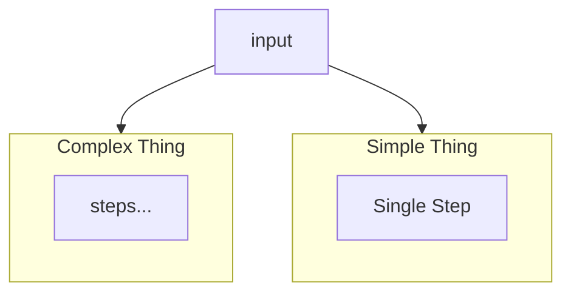
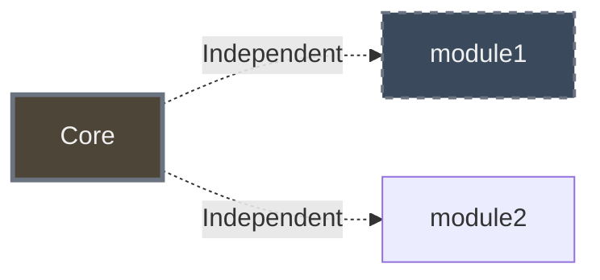

# Book Project - Claude Code Instructions

## Mermaid Diagram Color Palettes

### Dark Background (Original - for blog/dark themes)

Used in `manuscript/chapters/*.md` (original Hugo blog format):

```
Dark Fills:
- Dark Burgundy:  #4C3A3C
- Dark Slate:     #3A4A5C  
- Dark Forest:    #3A4C43
- Dark Brown:     #4C4538

Borders: #6b7280 (neutral gray)
Text: #f0f0f0 (bright white)
Background: transparent or #252627
```

### Light Background (for Leanpub PDF/white pages)

Used for `-light.png` variants when generating alternate versions:

```
Light Fills:
- Light Pink:     #E8C8C8 (replaces dark burgundy)
- Light Blue:     #C8D8E8 (replaces dark slate)
- Light Green:    #D4E8D4 (replaces dark forest)  
- Light Beige:    #E8D4C0 (replaces dark brown)
- Neutral Gray:   #E8E8E8 (for data/results boxes)

Inner Node Tints (lighter versions):
- Pink Tint:      #F0D8D8
- Green Tint:     #E0F0E0
- Beige Tint:     #F0E8D8

Borders: Dark versions for visibility
- Dark Brown:     #5a4a3a
- Dark Blue:      #3a4a5a
- Dark Green:     #3a5a3a
- Medium Gray:    #5a5a5a

Text: #2c2c2c (dark gray, nearly black)
Background: white
```

## Diagram Source Locations

**Total diagram files**: 67 PNG files (as of Dec 2025)  
**Active diagrams**: 66 (1 orphaned file not used in book)  
**Mermaid source coverage**: 66/66 active diagrams (100%)

### Source Location Pattern

| Chapters | Location | Count | Format |
|----------|----------|-------|--------|
| 1-9 | `manuscript/chapters/chapter-XX-name.md` | 16 | Embedded `` blocks |
| 2 | `manuscript/chapters/chapter-02-architecture-DIAGRAMS.md` | 3 | Separate file (ASCII conversions) |
| 10 | N/A | 0 | No diagrams |
| 11-14 | `manuscript/chapters/chapter-XX-name-DIAGRAMS.md` | 46 | Separate diagram files |

### Detailed Breakdown by Chapter

**Chapters with embedded mermaid (in main .md file):**
- Chapter 1: 4 diagrams (chapter-01-origins.md) + 1 orphaned file
- Chapter 2: 1 diagram (chapter-02-architecture.md)
- Chapter 3: 3 diagrams (chapter-03-json-schema.md)
- Chapter 4: 1 diagram (chapter-04-binary-databases.md)
- Chapter 5: 1 diagram (chapter-05-binary-apis.md)
- Chapter 6: 3 diagrams (chapter-06-json-rpc.md)
- Chapter 7: 3 diagrams (chapter-07-json-lines.md)
- Chapter 8: 2 diagrams (chapter-08-security.md)
- Chapter 9: 1 diagram (chapter-09-lessons.md)

**Chapters with separate DIAGRAMS.md files:**
- Chapter 2: 3 diagrams (chapter-02-architecture-DIAGRAMS.md) - ASCII conversions
- Chapter 10: 0 diagrams
- Chapter 11: 13 diagrams (chapter-11-api-design-DIAGRAMS.md)
- Chapter 12: 12 diagrams (chapter-12-data-pipelines-DIAGRAMS.md)
- Chapter 13: 8 diagrams (chapter-13-testing-DIAGRAMS.md)
- Chapter 14: 13 diagrams (chapter-14-future-DIAGRAMS.md)

**Orphaned files (not used in book):**
- `chapter-01-origins-diagram-5.png` - No reference in Leanpub version

**Total**: 16 + 3 + 46 = 65 mermaid sources = 66 active diagrams (diagram-2 in Chapter 2 already existed)

## Creating Light Diagram Variants

When user requests light versions for PDF A/B testing:

1. **Find original mermaid source**:
   - Chapters 1-9: `manuscript/chapters/chapter-XX-name.md`
   - Chapters 11-14: `manuscript/chapters/chapter-XX-name-DIAGRAMS.md`
   ```bash
   grep -A30 "" manuscript/chapters/chapter-01-origins.md
   ```

2. **Create light version** with same structure, light colors:
   - Replace dark fills with light pastels
   - Use dark text (#2c2c2c) instead of white
   - Use darker borders for visibility on white
   - Keep same layout/structure EXACTLY

3. **Generate both themes**:
   ```bash
   # Dark theme (transparent background)
   mmdc -i diagram-dark.mmd -o diagram-name.png -b transparent -w 1300
   
   # Light theme (white background)
   mmdc -i diagram-light.mmd -o diagram-name-light.png -b white -w 1300
   ```

4. **Save to organized locations**:
   - Light versions: `manuscript/images/diagrams/chapter-XX-name-diagram-N-light.png`
   - Dark versions: `manuscript/images/diagrams/dark/chapter-XX-name-diagram-N.png`
   - Copy light versions to: `manuscript-leanpub/resources/mermaid-diagrams/` (gitignored, for local builds)

## Diagram File Locations

**Git-tracked source of truth:**
```
manuscript/images/diagrams/
├── chapter-01-origins-diagram-1-light.png  (for Leanpub PDF/ebook)
├── chapter-01-origins-diagram-2-light.png
├── dark/
│   ├── chapter-01-origins-diagram-1.png  (for web/blog)
│   ├── chapter-01-origins-diagram-2.png
│   └── ...
└── ...
```

**Leanpub build location (gitignored):**
```
manuscript-leanpub/resources/mermaid-diagrams/
├── chapter-01-origins-diagram-1-light.png
└── ... (copy light versions here for Leanpub preview builds)
```

**Upload to Leanpub:** User manually uploads light versions from `manuscript/images/diagrams/` (not from dark/ subdirectory)

## Converting ASCII Diagrams to Mermaid

When finding ASCII box-drawing diagrams:

1. **Identify structure** (vertical stack vs horizontal flow)
2. **Create horizontal layout** if vertical would be >500px tall
3. **Use appropriate graph direction**:
   - `graph LR` for horizontal flows
   - `graph TB` for vertical stacks (avoid if too tall)
4. **Apply color palette** (dark or light based on target)
5. **Generate at appropriate width**: 1200-1300px for horizontal

## Diagram Naming Convention

**Pattern**: `chapter-XX-name-diagram-N.png`

- `XX` = chapter number (zero-padded)
- `name` = chapter slug (e.g., "origins", "architecture")
- `N` = sequential number (1, 2, 3, 4...)
- Add `-light` suffix for light-background variants

**Examples**:
- `chapter-01-origins-diagram-1.png` (dark)
- `chapter-01-origins-diagram-1-light.png` (light)
- `chapter-02-architecture-diagram-3.png` (dark)

## Mermaid Generation Commands

```bash
# Dark background (transparent)
mmdc -i source.mmd -o output.png -b transparent -w 1200

# Light background (white)
mmdc -i source.mmd -o output.png -b white -w 1300

# Horizontal with height limit
mmdc -i source.mmd -o output.png -b transparent -w 1200 -H 300
```

## Common Patterns

### Comparing Two Things (like XML vs JSON)


### Layered Architecture (horizontal to avoid tall diagrams)


### Modular vs Monolithic (dashed borders = independent)


## Troubleshooting

**Diagram too tall for PDF**:
- Convert from `graph TB` (top-bottom) to `graph LR` (left-right)
- Target max height: 300-400px
- Target width: 1200-1300px

**Colors too dark on white pages**:
- Create `-light` variant with pastel fills
- Use dark text/borders for visibility
- User can A/B test which version looks better

**Images not found in Leanpub**:
- Must exist in `manuscript-leanpub/resources/mermaid-diagrams/`
- User uploads manually to Leanpub platform
- Filename must exactly match markdown reference
