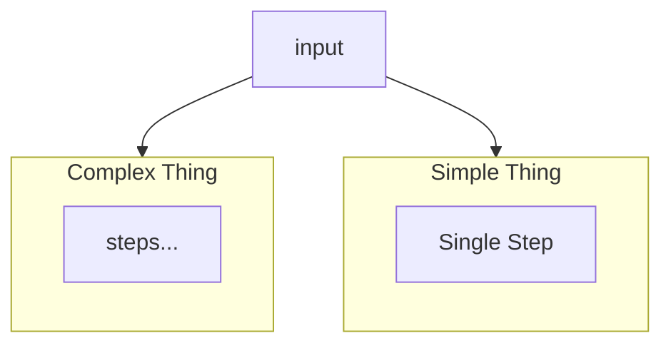
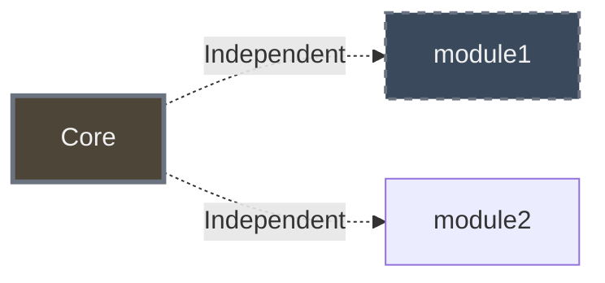

# Book Project - Claude Code Instructions

## Mermaid Diagram Color Palettes

### Dark Background (Original - for blog/dark themes)

Used in `manuscript/chapters/*.md` (original Hugo blog format):

```
Dark Fills:
- Dark Burgundy:  #4C3A3C
- Dark Slate:     #3A4A5C  
- Dark Forest:    #3A4C43
- Dark Brown:     #4C4538

Borders: #6b7280 (neutral gray)
Text: #f0f0f0 (bright white)
Background: transparent or #252627
```

### Light Background (for Leanpub PDF/white pages)

Used for `-light.png` variants when generating alternate versions:

```
Light Fills:
- Light Pink:     #E8C8C8 (replaces dark burgundy)
- Light Blue:     #C8D8E8 (replaces dark slate)
- Light Green:    #D4E8D4 (replaces dark forest)  
- Light Beige:    #E8D4C0 (replaces dark brown)
- Neutral Gray:   #E8E8E8 (for data/results boxes)

Inner Node Tints (lighter versions):
- Pink Tint:      #F0D8D8
- Green Tint:     #E0F0E0
- Beige Tint:     #F0E8D8

Borders: Dark versions for visibility
- Dark Brown:     #5a4a3a
- Dark Blue:      #3a4a5a
- Dark Green:     #3a5a3a
- Medium Gray:    #5a5a5a

Text: #2c2c2c (dark gray, nearly black)
Background: white
```

## Creating Light Diagram Variants

When user requests light versions for PDF A/B testing:

1. **Find original mermaid source** in `manuscript/chapters/*.md`:
   ```bash
   grep -A30 "" manuscript/chapters/chapter-01-origins.md
   ```

2. **Create light version** with same structure, light colors:
   - Replace dark fills with light pastels
   - Use dark text (#2c2c2c) instead of white
   - Use darker borders for visibility on white
   - Keep same layout/structure

3. **Generate with white background**:
   ```bash
   mmdc -i diagram-light.mmd -o diagram-name-light.png -b white -w 1300
   ```

4. **Save with `-light` suffix**:
   - `chapter-XX-name-diagram-N-light.png`
   - Keep in same directories as originals
   - Don't replace originals - user swaps manually on Leanpub

## Diagram File Locations

**Source of truth (git tracked):**
```
manuscript/images/diagrams/
├── chapter-01-origins-diagram-1.png (dark)
├── chapter-01-origins-diagram-1-light.png (light variant)
└── ...
```

**Leanpub build location (gitignored):**
```
manuscript-leanpub/resources/mermaid-diagrams/
├── chapter-01-origins-diagram-1.png
└── ... (copy here for Leanpub to find)
```

**Note**: User uploads images to Leanpub manually, so ensure both locations have updated files.

## Converting ASCII Diagrams to Mermaid

When finding ASCII box-drawing diagrams:

1. **Identify structure** (vertical stack vs horizontal flow)
2. **Create horizontal layout** if vertical would be >500px tall
3. **Use appropriate graph direction**:
   - `graph LR` for horizontal flows
   - `graph TB` for vertical stacks (avoid if too tall)
4. **Apply color palette** (dark or light based on target)
5. **Generate at appropriate width**: 1200-1300px for horizontal

## Diagram Naming Convention

**Pattern**: `chapter-XX-name-diagram-N.png`

- `XX` = chapter number (zero-padded)
- `name` = chapter slug (e.g., "origins", "architecture")
- `N` = sequential number (1, 2, 3, 4...)
- Add `-light` suffix for light-background variants

**Examples**:
- `chapter-01-origins-diagram-1.png` (dark)
- `chapter-01-origins-diagram-1-light.png` (light)
- `chapter-02-architecture-diagram-3.png` (dark)

## Mermaid Generation Commands

```bash
# Dark background (transparent)
mmdc -i source.mmd -o output.png -b transparent -w 1200

# Light background (white)
mmdc -i source.mmd -o output.png -b white -w 1300

# Horizontal with height limit
mmdc -i source.mmd -o output.png -b transparent -w 1200 -H 300
```

## Common Patterns

### Comparing Two Things (like XML vs JSON)


### Layered Architecture (horizontal to avoid tall diagrams)


### Modular vs Monolithic (dashed borders = independent)


## Troubleshooting

**Diagram too tall for PDF**:
- Convert from `graph TB` (top-bottom) to `graph LR` (left-right)
- Target max height: 300-400px
- Target width: 1200-1300px

**Colors too dark on white pages**:
- Create `-light` variant with pastel fills
- Use dark text/borders for visibility
- User can A/B test which version looks better

**Images not found in Leanpub**:
- Must exist in `manuscript-leanpub/resources/mermaid-diagrams/`
- User uploads manually to Leanpub platform
- Filename must exactly match markdown reference
