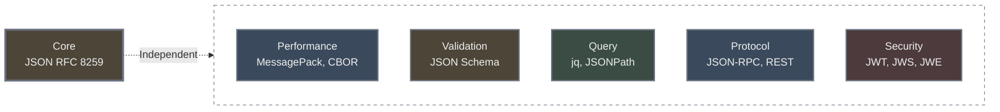
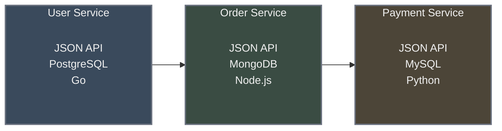

# Chapter 2: Architecture Mermaid Diagrams

**Purpose:** Visual representations of monolithic vs modular architecture patterns

**Note:** These diagrams were created by converting ASCII art to Mermaid (Dec 2025)

---

## 1. XML Monolithic Stack (Horizontal)

```mermaid
graph LR
    core["Core Layer<br/>XML 1.0<br/>Namespaces"]
    validation["Validation Layer<br/>DTD, XSD<br/>RelaxNG"]
    query["Query Layer<br/>XPath<br/>XQuery"]
    transform["Transformation<br/>XSLT<br/>XSL-FO"]
    protocol["Protocol Layer<br/>SOAP, WSDL<br/>WS-* 50+ specs"]
    security["Security Layer<br/>XML Signature<br/>XML Encryption"]
    
    core --> validation
    validation --> query
    query --> transform
    transform --> protocol
    protocol --> security
    
    style core fill:#4C4538,stroke:#6b7280,stroke-width:2px,color:#f0f0f0
    style validation fill:#3A4A5C,stroke:#6b7280,stroke-width:2px,color:#f0f0f0
    style query fill:#3A4C43,stroke:#6b7280,stroke-width:2px,color:#f0f0f0
    style transform fill:#4C4538,stroke:#6b7280,stroke-width:2px,color:#f0f0f0
    style protocol fill:#3A4A5C,stroke:#6b7280,stroke-width:2px,color:#f0f0f0
    style security fill:#4C3A3C,stroke:#6b7280,stroke-width:2px,color:#f0f0f0
```

## 2. JSON Modular Stack (Horizontal with Independent Connections)

## 3. Microservices Architecture

---

## Light Background Versions

For each diagram above, create light version by replacing:
- Dark fills → Light pastels (E8C8C8, C8D8E8, D4E8D4, E8D4C0)
- White text → Dark text (#2c2c2c)
- Generate with: `mmdc -i source.mmd -o output-light.png -b white -w 1300`
