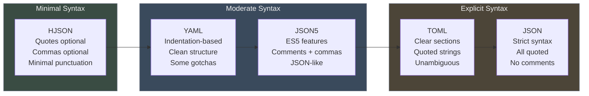
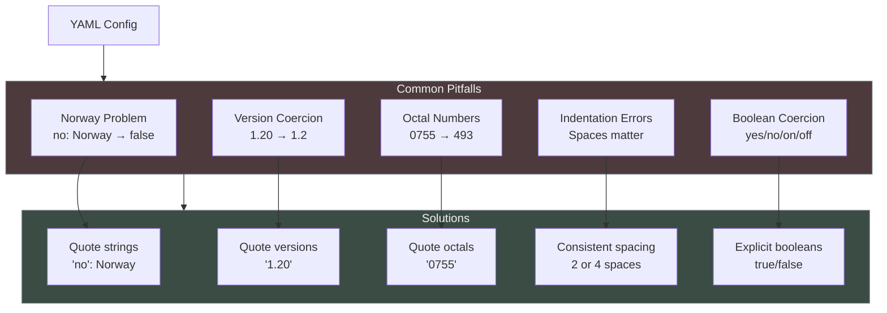
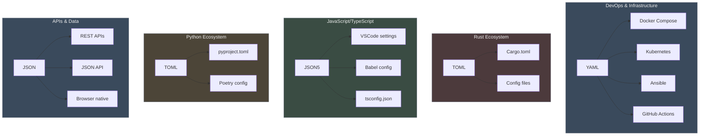
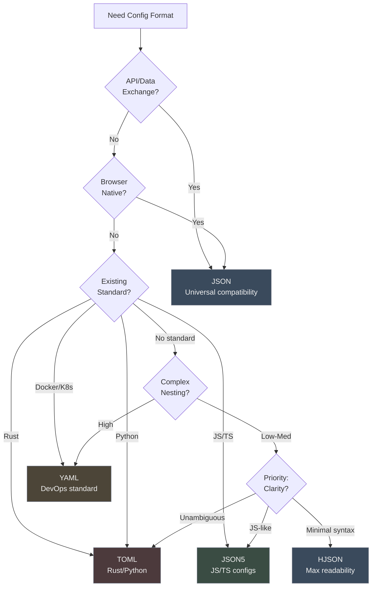
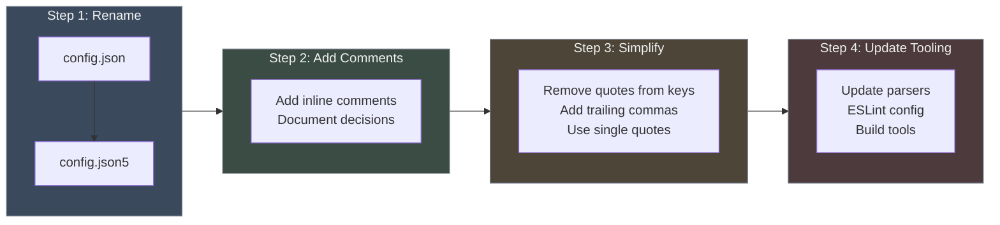

# Chapter 10: Human-Friendly JSON Variants

JSON succeeded as a data interchange format because it was simple, minimal, and easy for machines to parse. But that same simplicity creates friction when humans edit configuration files daily. No comments to explain decisions. Trailing comma errors that break builds. Everything quoted, even simple identifiers.

This chapter explores four formats that emerged to solve the configuration gap: JSON5 (minimal extensions), HJSON (maximum readability), YAML (widespread adoption), and TOML (unambiguous clarity). Each represents a different point on the human-readability spectrum, and each found its niche in the ecosystem.

**Configuration Format Evolution Timeline:**

| Year/Era | Format | Key Features | Adoption Context |
|----------|--------|--------------|------------------|
| 1980s | INI Files | Windows .ini, simple key=value | Early personal computers |
| 1990s | XML | Complex, verbose | Enterprise dominance |
| 2001 | JSON | Simple, minimal | No comments (pain point) |
| 2012 | TOML | INI-inspired clarity | Rust adoption |
| 2013 | JSON5 | ES5 syntax | JSON + comments |
| 2014 | HJSON | Extreme readability | Minimal syntax |
| 2015+ | YAML | Docker, K8s, CI/CD | DevOps standard |

## The Configuration Problem

JSON was designed for APIs and data exchange between machines. Configuration files serve a different purpose: humans edit them daily, debug them under pressure, and need to explain decisions to teammates. The mismatch creates real pain.

### What Makes JSON Hard for Configs

**No comments:**
```json
{
  "port": 8080,
  "timeout": 5000,
  "maxConnections": 1000
}
```

Why is the port 8080? Why 5000ms timeout? Future developers have no context. In a real codebase, you'd want:

```javascript
// Port 8080 to avoid conflicts with local PostgreSQL (5432)
// Timeout increased to 5000ms after investigating prod issues (JIRA-1234)
// Max connections set for AWS t3.medium instance limits
```

**Trailing comma errors:**
```json
{
  "name": "my-app",
  "version": "1.0.0",
}
```

Add a new field, forget to remove the trailing comma → `Unexpected token }`. This breaks CI, wastes 30 minutes debugging what should be a 30-second change.

**Everything quoted:**
```json
{
  "name": "my-app",
  "port": "8080",
  "features": ["logging", "metrics", "tracing"]
}
```

The visual noise of quotes everywhere reduces readability. Compare to a format where `name: my-app` is valid.

**Multiline strings require escaping:**
```json
{
  "description": "This is a long description that spans multiple lines but must be written as a single line with \\n escapes which makes it hard to read and maintain"
}
```

### Real-World Pain Points

**Team scenario 1:** Developer adds new configuration field, includes trailing comma (habit from JavaScript), pushes to CI. Build fails. Reviews git diff, spots comma, fixes, pushes again. **Time wasted: 30 minutes.**

**Team scenario 2:** Configuration file grows to 200 lines. New team member asks "why is this value set this way?" No comments to explain. Must search git history, find commit from 2 years ago, read discussion in closed PR. **Time wasted: 2 hours.**

**Team scenario 3:** Docker Compose file in JSON would be 300 lines of deeply nested structure with quotes everywhere. Team switches to YAML. File becomes 150 lines, readable at a glance. **Productivity gain: significant.**

The configuration problem is real, widespread, and expensive. The ecosystem responded with four modular solutions, each optimizing different trade-offs.



## JSON5: ECMAScript 5 for Configs

JSON5 takes the conservative approach: add ECMAScript 5 syntax features to JSON while maintaining familiarity for JavaScript developers. The philosophy is minimal disruption, maximum compatibility.

### Core Features

**Comments (single and multi-line):**
```json5
{
  // This is a single-line comment
  "name": "my-app",
  
  /* This is a
     multi-line comment */
  "version": "1.0.0"
}
```

**Trailing commas allowed:**
```json5
{
  "dependencies": {
    "express": "^4.18.0",
    "react": "^18.2.0",  // Comma here is fine
  },
}
```

**Unquoted keys:**
```json5
{
  name: "my-app",        // No quotes needed
  port: 8080,
  isEnabled: true
}
```

**Single or double quotes:**
```json5
{
  name: 'my-app',           // Single quotes
  description: "Also works"  // Double quotes
}
```

**Additional number formats:**
```json5
{
  hexadecimal: 0xFFFF,
  leadingDecimal: .5,       // 0.5
  trailingDecimal: 5.,      // 5.0
  positiveSign: +5,
  infinity: Infinity,
  notANumber: NaN
}
```

### Real-World Usage

**VSCode settings:**
```json5
// .vscode/settings.json5
{
  // Editor config
  "editor.tabSize": 2,
  "editor.formatOnSave": true,
  
  // Language-specific
  "[javascript]": {
    "editor.defaultFormatter": "esbenp.prettier-vscode",
  },
  
  // Extensions
  "eslint.validate": [
    "javascript",
    "typescript",
  ],
}
```

**Babel config:**
```json5
// babel.config.json5
{
  presets: [
    ['@babel/preset-env', {
      targets: {
        node: 'current',
      },
    }],
    '@babel/preset-typescript',
  ],
  
  // Plugins applied in order
  plugins: [
    '@babel/plugin-proposal-class-properties',
    '@babel/plugin-proposal-optional-chaining',
  ],
}
```

**TypeScript config (tsconfig.json):**
While technically still `.json`, TypeScript's compiler accepts comments and trailing commas (JSON5-like):
```json5
{
  "compilerOptions": {
    "target": "ES2020",
    "module": "commonjs",
    "strict": true,           // Enables all strict checks
    "esModuleInterop": true,  // Allows default imports
  },
}
```

### When to Use JSON5

**Strong fit:**
- JavaScript/TypeScript projects (natural syntax)
- Migrating from JSON (easiest transition)
- Team familiar with ES5 features
- Projects using Webpack, Babel, or tools with JSON5 support

**Avoid when:**
- Need maximum compatibility (stick with JSON)
- Team unfamiliar with JavaScript
- Parsing performance critical (JSON faster)

### Language Support

**JavaScript:**
```javascript
const JSON5 = require('json5');

const config = JSON5.parse(`{
  // Comment here
  name: 'my-app',
  port: 8080,
}`);

console.log(config.name); // "my-app"
```

**Go:**
```go
import "github.com/yosuke-furukawa/json5/encoding/json5"

var config Config
data := []byte(`{name: 'my-app', port: 8080}`)
json5.Unmarshal(data, &config)
```

**Python:**
```python
import json5

with open('config.json5') as f:
    config = json5.load(f)
print(config['name'])
```

## YAML: The DevOps Standard

YAML (YAML Ain't Markup Language) dominates infrastructure configuration. Docker Compose, Kubernetes, GitHub Actions, Ansible, GitLab CI--all use YAML. Understanding why reveals lessons about ecosystem adoption.

### Why YAML Won DevOps

**Indentation-based structure (minimal punctuation):**
```yaml
app:
  name: my-app
  server:
    port: 8080
    host: localhost
  features:
    - logging
    - metrics
    - tracing
```

Equivalent JSON requires braces, commas, quotes:
```json
{
  "app": {
    "name": "my-app",
    "server": {
      "port": 8080,
      "host": "localhost"
    },
    "features": ["logging", "metrics", "tracing"]
  }
}
```

**Natural multiline strings:**
```yaml
description: |
  This is a literal block scalar.
  Newlines are preserved.
  Perfect for scripts or long text.

folded_text: >
  This is a folded scalar.
  Lines are joined with spaces.
  Good for paragraphs.
```

**Anchors and aliases (DRY configs):**
```yaml
defaults: &defaults
  timeout: 30
  retries: 3
  log_level: info

production:
  <<: *defaults
  host: prod.example.com
  log_level: error  # Override

staging:
  <<: *defaults
  host: staging.example.com
```

### The YAML Gotchas

YAML's power comes with complexity. Several gotchas trip up developers:



**The Norway problem:**
```yaml
countries:
  no: Norway  # Parsed as "false: Norway" !
  
# Fix by quoting:
countries:
  "no": Norway
```

YAML treats `no`, `yes`, `on`, `off`, `true`, `false` as booleans. Country codes get interpreted as booleans.

**Implicit type coercion:**
```yaml
version: 1.20  # Becomes float 1.2 (loses trailing zero)
port: 08080    # Octal! Becomes 4160 in decimal

# Always quote version strings:
version: "1.20"
port: "8080"
```

**Indentation sensitivity:**
```yaml
# Wrong (mixed spaces/tabs or inconsistent):
app:
  name: my-app
   port: 8080  # Error: inconsistent indentation

# Right:
app:
  name: my-app
  port: 8080
```

**Multiline variants are confusing:**
```yaml
literal: |       # Keeps newlines, adds trailing newline
  Line 1
  Line 2

literal_clip: |-  # Keeps newlines, no trailing newline
  Line 1
  Line 2

folded: >        # Joins lines, adds trailing newline
  Line 1
  Line 2

folded_clip: >-  # Joins lines, no trailing newline
  Line 1
  Line 2
```

### Real Docker Compose Example

```yaml
version: '3.8'

services:
  web:
    image: nginx:alpine
    ports:
      - "80:80"
      - "443:443"
    volumes:
      - ./nginx.conf:/etc/nginx/nginx.conf:ro
      - ./html:/usr/share/nginx/html:ro
    environment:
      - NGINX_HOST=example.com
      - NGINX_PORT=80
    networks:
      - frontend
    depends_on:
      - api
  
  api:
    build:
      context: ./api
      dockerfile: Dockerfile
    environment:
      - DATABASE_URL=postgresql://user:pass@db:5432/myapp
      - REDIS_URL=redis://cache:6379
    networks:
      - frontend
      - backend
    depends_on:
      - db
      - cache
  
  db:
    image: postgres:15
    volumes:
      - postgres_data:/var/lib/postgresql/data
    environment:
      - POSTGRES_PASSWORD=secure_password
    networks:
      - backend
  
  cache:
    image: redis:7-alpine
    networks:
      - backend

networks:
  frontend:
  backend:

volumes:
  postgres_data:
```

This would be 2-3x longer in JSON with quotes and braces everywhere.

### When to Use YAML

**Strong fit:**
- Docker Compose files
- Kubernetes manifests
- CI/CD configs (GitHub Actions, GitLab CI)
- Ansible playbooks
- Configuration with repeated sections (use anchors)

**Avoid when:**
- Team unfamiliar with YAML gotchas
- Need deterministic parsing (type coercion issues)
- Simple configs (TOML clearer)
- Programmatic generation (harder than JSON/TOML)

## TOML: Clarity Over Terseness

TOML (Tom's Obvious, Minimal Language) prioritizes unambiguous clarity. The Rust ecosystem adopted it as the standard for `Cargo.toml`, and Python followed with `pyproject.toml`.

### Philosophy: INI-Inspired Sections

TOML brings back the clarity of INI files with modern features:

**Clear sections:**
```toml
[package]
name = "my-app"
version = "1.0.0"
authors = ["Alice <alice@example.com>"]

[dependencies]
serde = "1.0"
tokio = "1.0"
reqwest = "0.11"
```

**Nested sections with dot notation:**
```toml
[server]
host = "localhost"
port = 8080

[server.tls]
enabled = true
cert_path = "/etc/certs/server.pem"
key_path = "/etc/certs/server.key"
```

**Arrays of tables:**
```toml
[[servers]]
name = "alpha"
ip = "10.0.0.1"
role = "primary"

[[servers]]
name = "beta"
ip = "10.0.0.2"
role = "replica"
```

Equivalent in YAML or JSON requires more nesting or array syntax.

**Explicit types (no coercion):**
```toml
port = 8080          # Integer
timeout = 5.5        # Float
enabled = true       # Boolean
name = "my-app"      # String (must be quoted)
date = 2024-01-15    # Date (first-class type)
```

**Multiline strings:**
```toml
description = """
This is a multi-line string.
Newlines are preserved.
Perfect for documentation.
"""
```

### Real Cargo.toml Example

```toml
[package]
name = "my-rust-app"
version = "0.1.0"
edition = "2021"
authors = ["Alice <alice@example.com>"]
description = "A sample Rust application"
license = "MIT"
repository = "https://github.com/alice/my-rust-app"

[dependencies]
# Web framework
actix-web = "4.0"

# Async runtime
tokio = { version = "1.0", features = ["full"] }

# Serialization
serde = { version = "1.0", features = ["derive"] }
serde_json = "1.0"

# Database
sqlx = { version = "0.7", features = ["postgres", "runtime-tokio-native-tls"] }

# Logging
tracing = "0.1"
tracing-subscriber = "0.3"

[dev-dependencies]
criterion = "0.5"

[[bench]]
name = "my_benchmark"
harness = false

[profile.release]
opt-level = 3
lto = true
codegen-units = 1
```

### When to Use TOML

**Strong fit:**
- Rust projects (ecosystem standard)
- Python projects (`pyproject.toml`)
- Simple to moderate nested configs
- Need unambiguous parsing (no type coercion)
- Team unfamiliar with YAML's gotchas

**Avoid when:**
- Deep nesting (dotted keys get verbose)
- Need anchors/references (not supported)
- Team already standardized on YAML
- Complex configurations (YAML more concise)

## JSON5 vs HJSON vs YAML vs TOML: Choosing Your Format

Each format occupies a different niche. The right choice depends on your team, tools, and tolerance for ambiguity.

### Comparison Matrix



| Dimension | JSON5 | HJSON | YAML | TOML |
|-----------|-------|-------|------|------|
| **Comments** | `//` `/* */` | `#` | `#` | `#` |
| **Trailing commas** | Yes | Optional | N/A | N/A |
| **Unquoted keys** | Yes | Yes | Yes | No |
| **Unquoted strings** | No | Yes (mostly) | Yes | No |
| **Multiline strings** | Escaped | Natural | Natural | Natural |
| **Indentation-based** | No | No | Yes | No |
| **Type ambiguity** | Low | Medium | **High** | **Low** |
| **Learning curve** | Easy | Easy | Medium | Easy |
| **Tooling support** | Good | Limited | **Universal** | Good |
| **Ecosystem** | JS/TS | Small | **DevOps** | **Rust/Python** |
| **Best for** | JS configs | Docs | Infrastructure | Package configs |

### Decision Framework



**Use JSON when:**
- API responses (machines don't need comments)
- Browser parsing (native support)
- Maximum compatibility required
- Performance critical

**Use JSON5 when:**
- JavaScript/TypeScript project
- Easiest migration from JSON
- Want comments without learning new syntax
- Webpack, Babel, VSCode configs

**Use YAML when:**
- Docker Compose, Kubernetes
- CI/CD pipelines
- Ansible playbooks
- Team already knows YAML
- Complex configs with repeated sections (anchors)

**Use TOML when:**
- Rust project (Cargo.toml standard)
- Python project (pyproject.toml)
- Want unambiguous clarity
- Simple to moderate nesting
- Team unfamiliar with YAML gotchas

**Use HJSON when:**
- Documentation examples
- Extreme readability priority
- Small internal tools
- Don't care about ecosystem size

## Migration Strategies

Switching configuration formats mid-project requires planning. Here's how to migrate safely.

### JSON → JSON5 (Easiest)



**Step 1:** Rename files:
```bash
mv config.json config.json5
mv .eslintrc.json .eslintrc.json5
```

**Step 2:** Update tooling to parse JSON5:
```javascript
// Before:
const config = require('./config.json');

// After:
const JSON5 = require('json5');
const fs = require('fs');
const config = JSON5.parse(fs.readFileSync('./config.json5', 'utf8'));
```

**Step 3:** Gradually add comments and trailing commas:
```json5
{
  // Database config
  "database": {
    "host": "localhost",
    "port": 5432,  // Trailing comma now OK
  },
}
```

**Benefit:** JSON is valid JSON5, so migration can be gradual.

### JSON → YAML

**Use converter:**
```bash
npm install -g json2yaml
json2yaml config.json > config.yaml
```

**Manual cleanup:**
- Remove excessive quotes (YAML doesn't need quotes for simple strings)
- Add comments to explain complex sections
- Use anchors for repeated config

**Watch for gotchas:**
- Test for type coercion (version: 1.20 becoming 1.2)
- Quote ambiguous values (`no`, `yes`, `on`, `off`)
- Verify indentation consistency

### JSON → TOML

**Flatten structure into sections:**

Before (JSON):
```json
{
  "server": {
    "host": "localhost",
    "port": 8080,
    "tls": {
      "enabled": true
    }
  }
}
```

After (TOML):
```toml
[server]
host = "localhost"
port = 8080

[server.tls]
enabled = true
```

**Best for:** Configs with natural sections (server, database, logging).

## Conclusion: Configuration Deserves Better Than JSON

JSON succeeded as a data interchange format, but its limitations create real friction for human-edited configuration files. The ecosystem responded with four modular solutions, each optimizing different trade-offs:

- **JSON5** adds minimal syntax (comments, trailing commas) for JavaScript developers
- **HJSON** maximizes readability with optional quotes and commas
- **YAML** dominates DevOps with indentation-based structure
- **TOML** provides unambiguous clarity for package configs

The lesson from Chapter 2 applies: JSON's incompleteness enabled this ecosystem to flourish. Rather than adding comments to JSON's spec (which would complicate parsers and break compatibility), the ecosystem created separate, purpose-built solutions.

Choose the format that matches your team, tooling, and tolerance for ambiguity. And remember: configuration is a distinct use case that deserves better than a data interchange format designed for machines.
