# Chapter 11: API Design Mermaid Diagrams

**Purpose:** Visual patterns for REST API design with JSON

---

## 1. Richardson Maturity Model

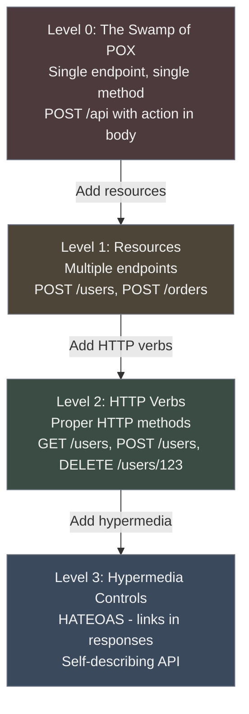

## 2. RESTful Resource Design

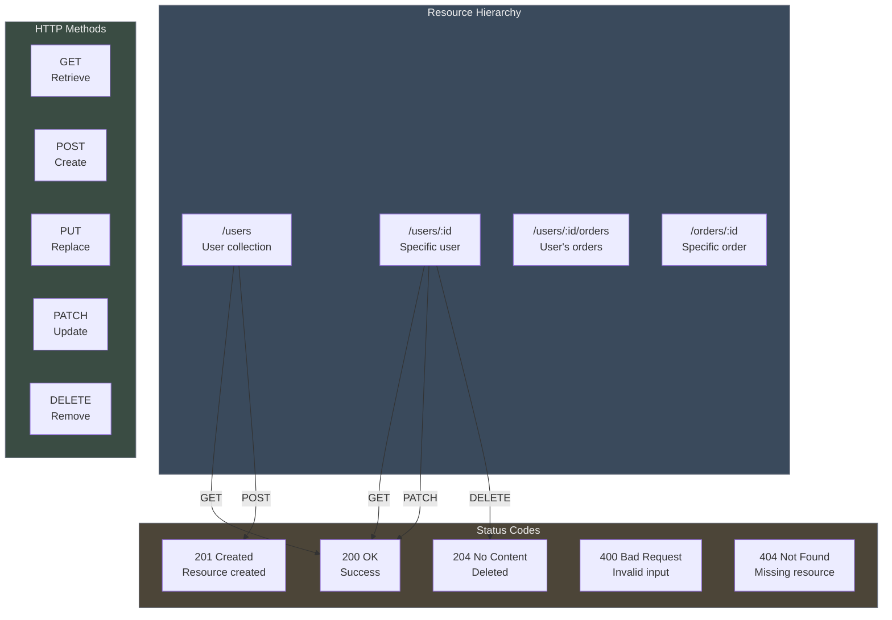

## 3. Pagination Comparison

```mermaid
flowchart TB
    subgraph offset["Offset-Based"]
        o1["Page 1<br/>offset=0, limit=20"]
        o2["Page 2<br/>offset=20, limit=20"]
        o3["Page 3<br/>offset=40, limit=20"]
        oprob["❌ Problems:<br/>Inefficient for large offsets<br/>Inconsistent if data changes"]
    end
    
    subgraph cursor["Cursor-Based"]
        c1["Page 1<br/>limit=20"]
        c2["Page 2<br/>cursor=abc123, limit=20"]
        c3["Page 3<br/>cursor=def456, limit=20"]
        cbenefit["✓ Benefits:<br/>Efficient (uses index)<br/>Consistent results"]
    end
    
    subgraph keyset["Keyset"]
        k1["Page 1<br/>limit=20"]
        k2["Page 2<br/>after=102, limit=20"]
        k3["Page 3<br/>after=122, limit=20"]
        kbenefit["✓ Benefits:<br/>Simple & efficient<br/>Transparent cursor"]
    end
    
    o1 --> o2 --> o3 --> oprob
    c1 --> c2 --> c3 --> cbenefit
    k1 --> k2 --> k3 --> kbenefit
    
    style offset fill:#4C3A3C,stroke:#6b7280,color:#f0f0f0
    style cursor fill:#3A4C43,stroke:#6b7280,color:#f0f0f0
    style keyset fill:#3A4A5C,stroke:#6b7280,color:#f0f0f0
```

## 4. API Request/Response Flow

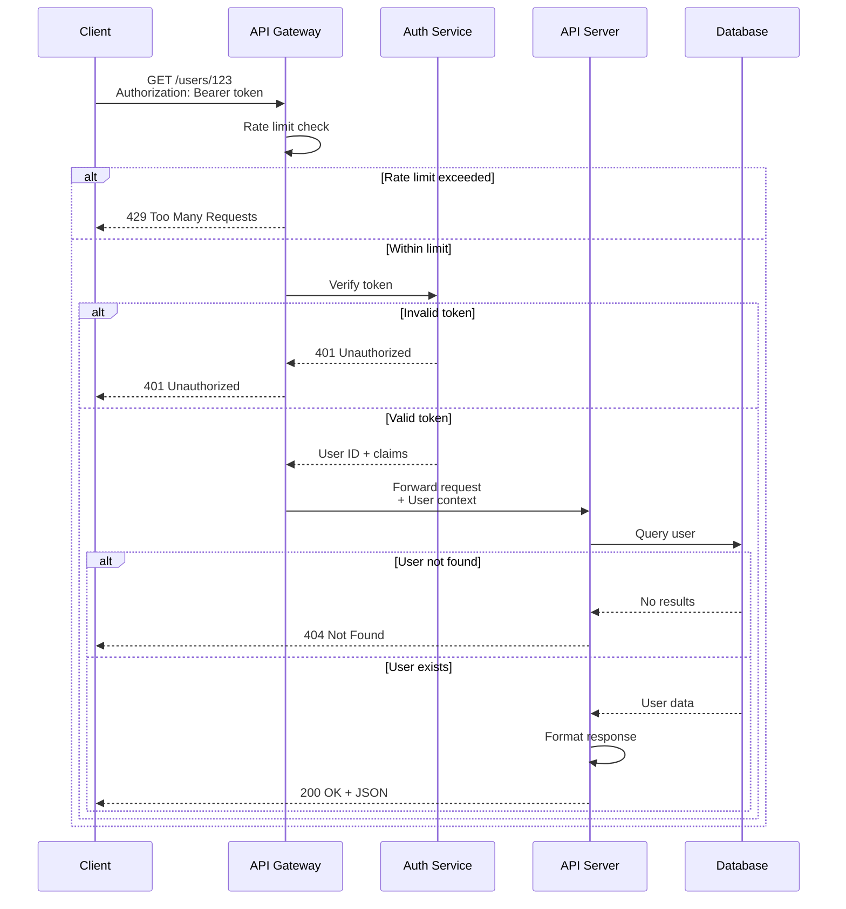

## 5. Error Response Structure

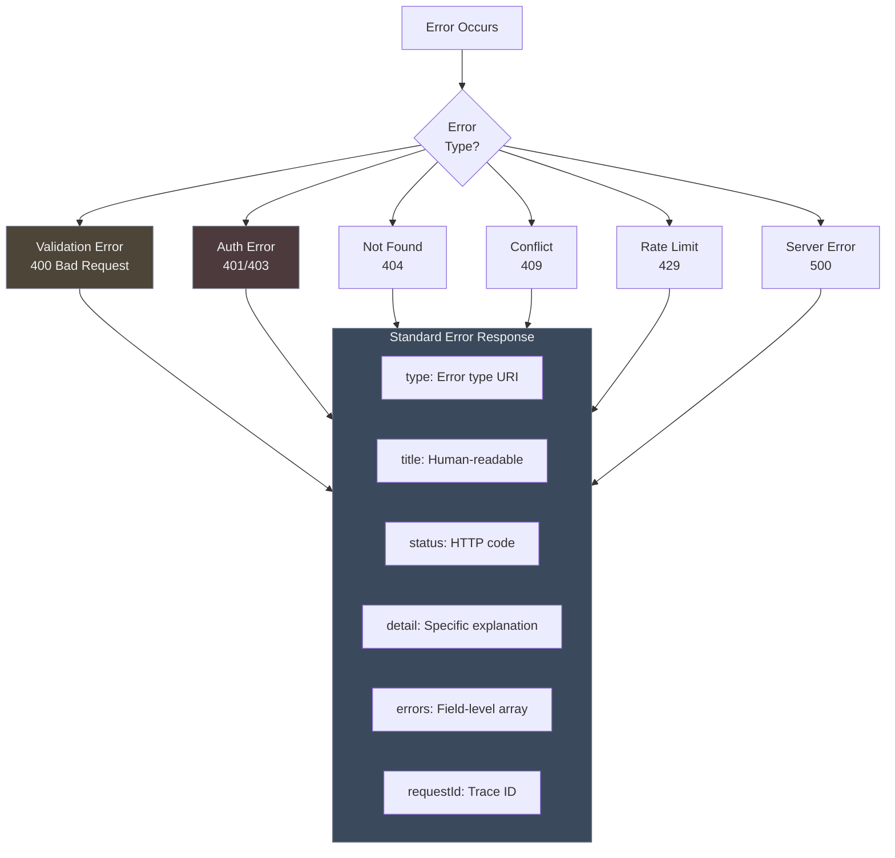

## 6. API Versioning Strategies

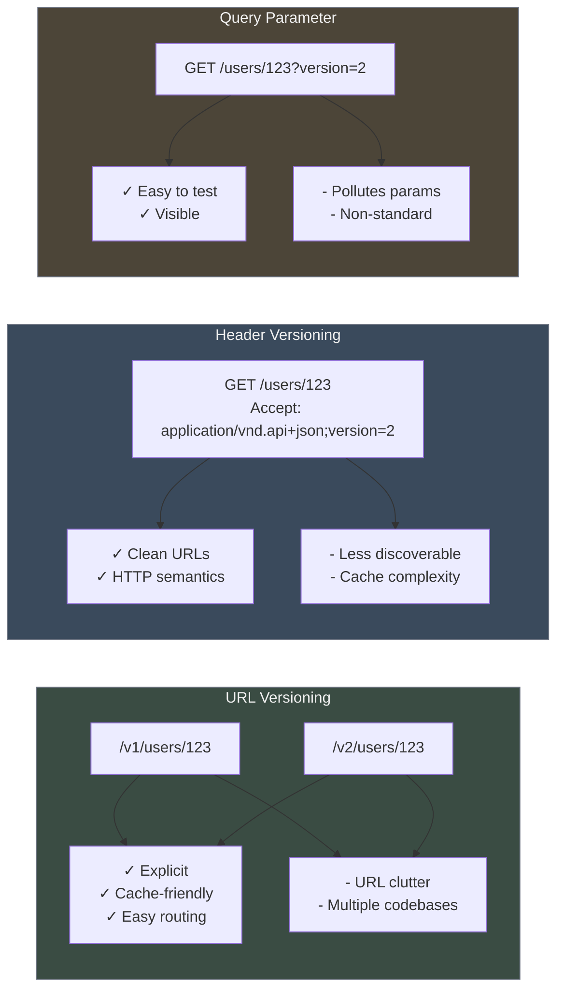

## 7. Rate Limiting Flow

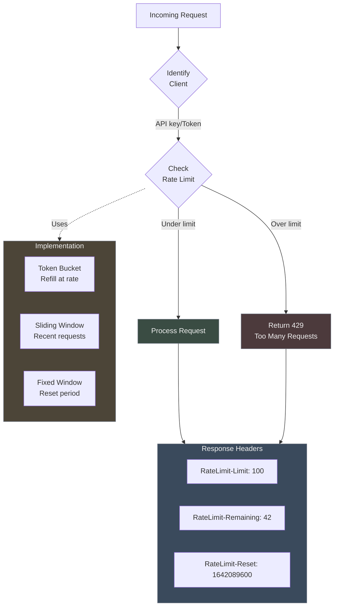

## 8. Authentication & Authorization Flow

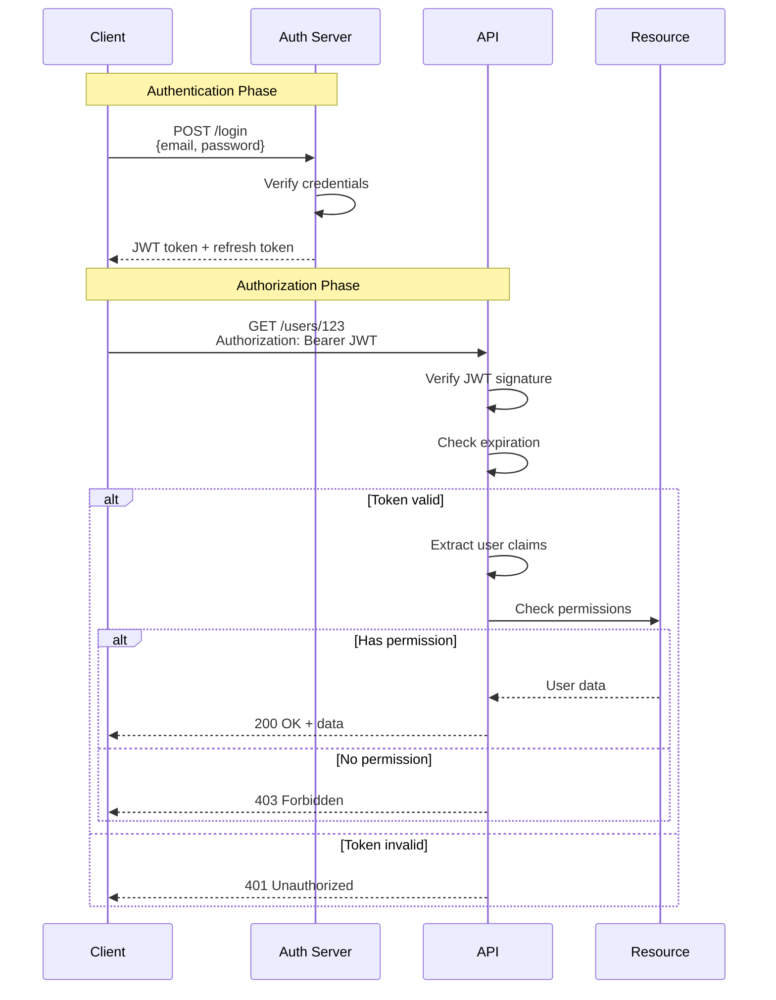

## 9. Content Negotiation

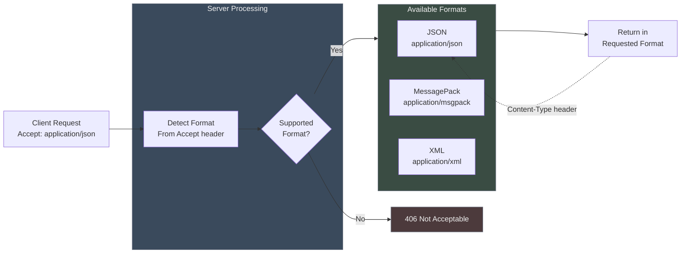

## 10. API Deprecation Timeline

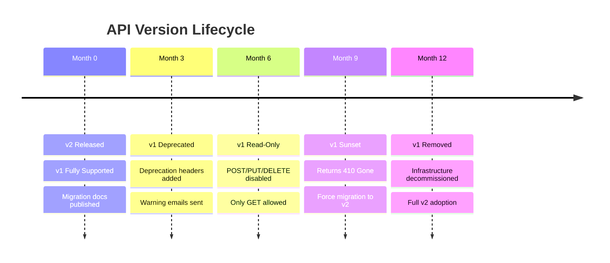

## 11. HATEOAS Example

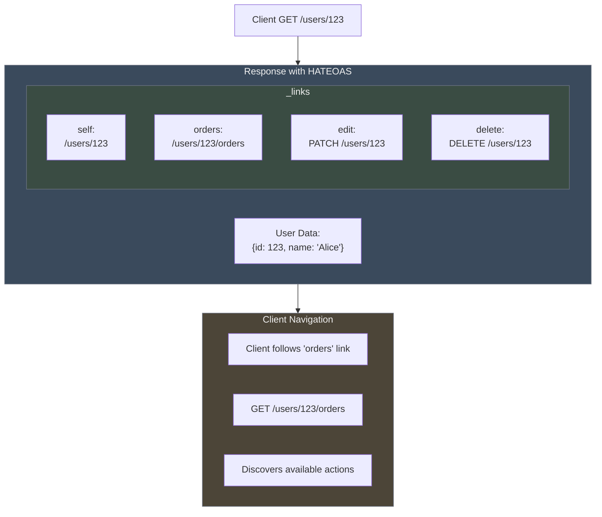

## 12. Input Validation Pipeline

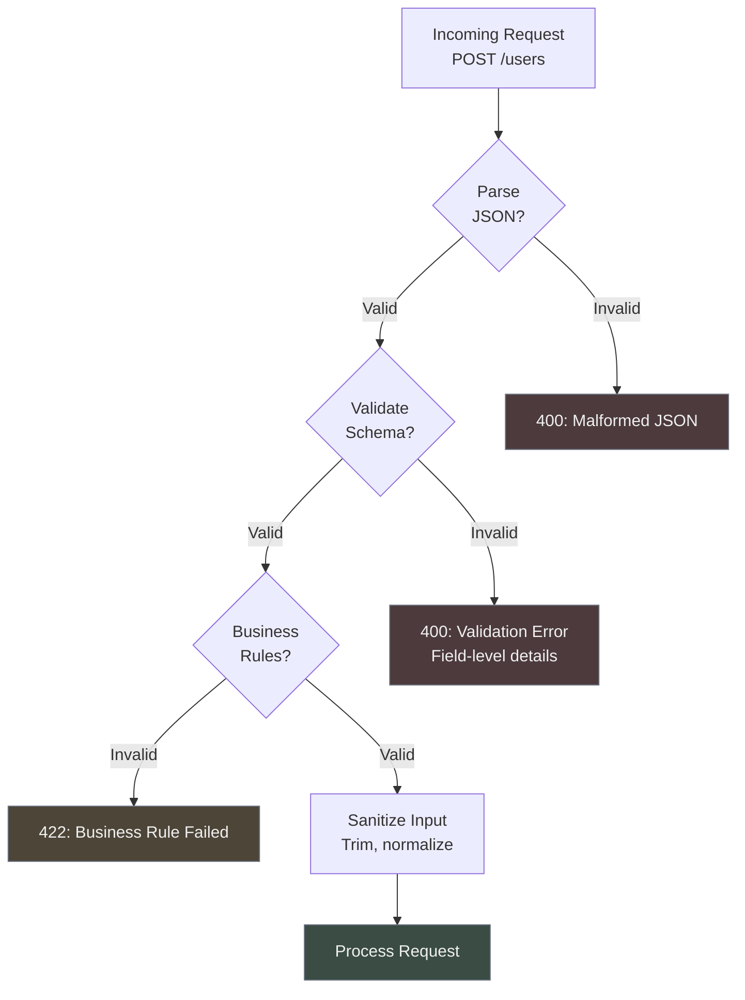

## 13. API Security Layers

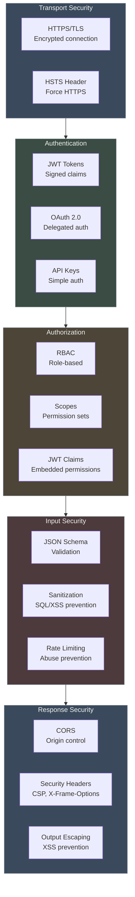
