# Chapter 12: Data Pipeline Mermaid Diagrams

**Purpose:** Visual architecture diagrams for data pipeline patterns

---

## 1. Complete Data Pipeline Architecture

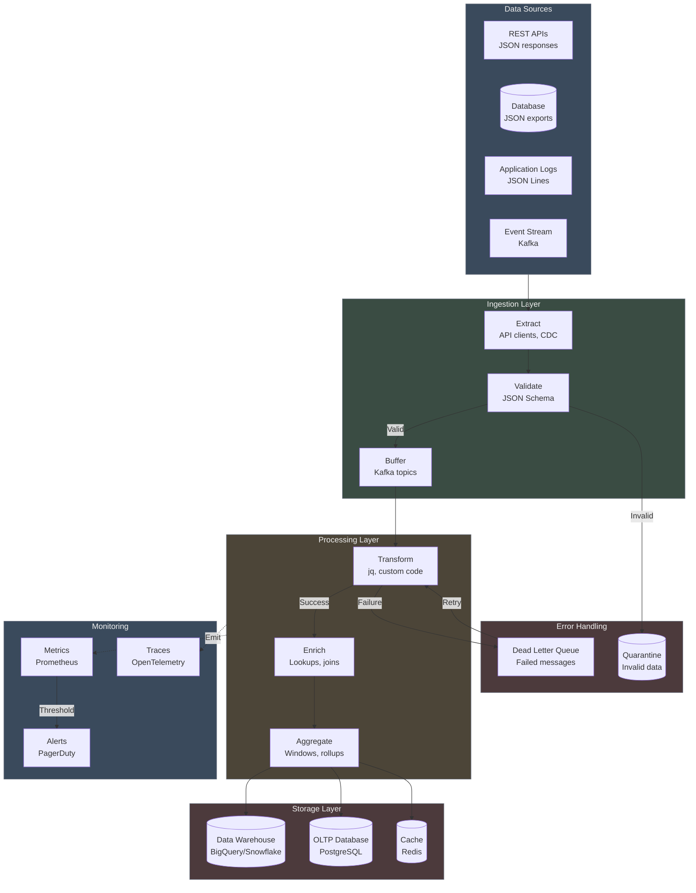

## 2. Kafka Message Flow

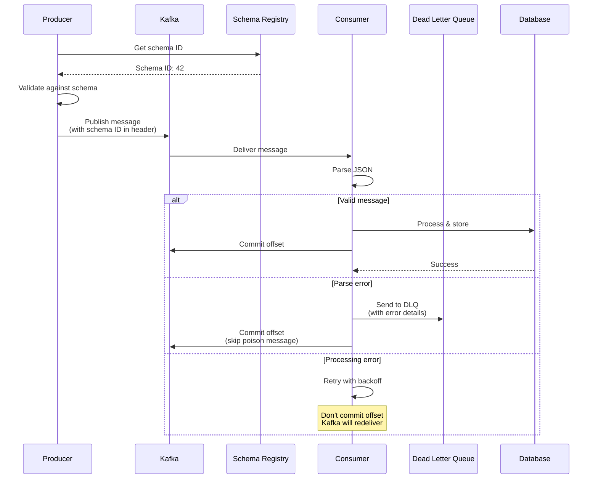

## 3. ETL Pipeline Pattern

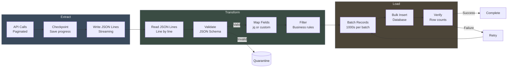

## 4. Error Handling Flow

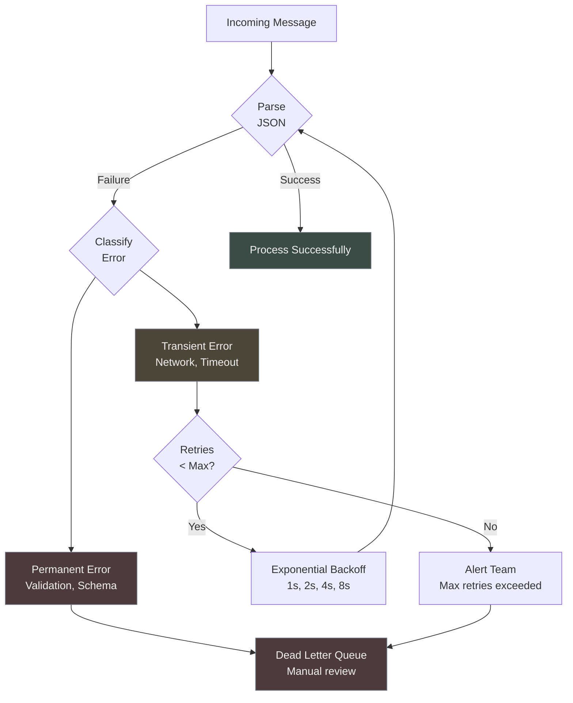

## 5. Stream Processing Window

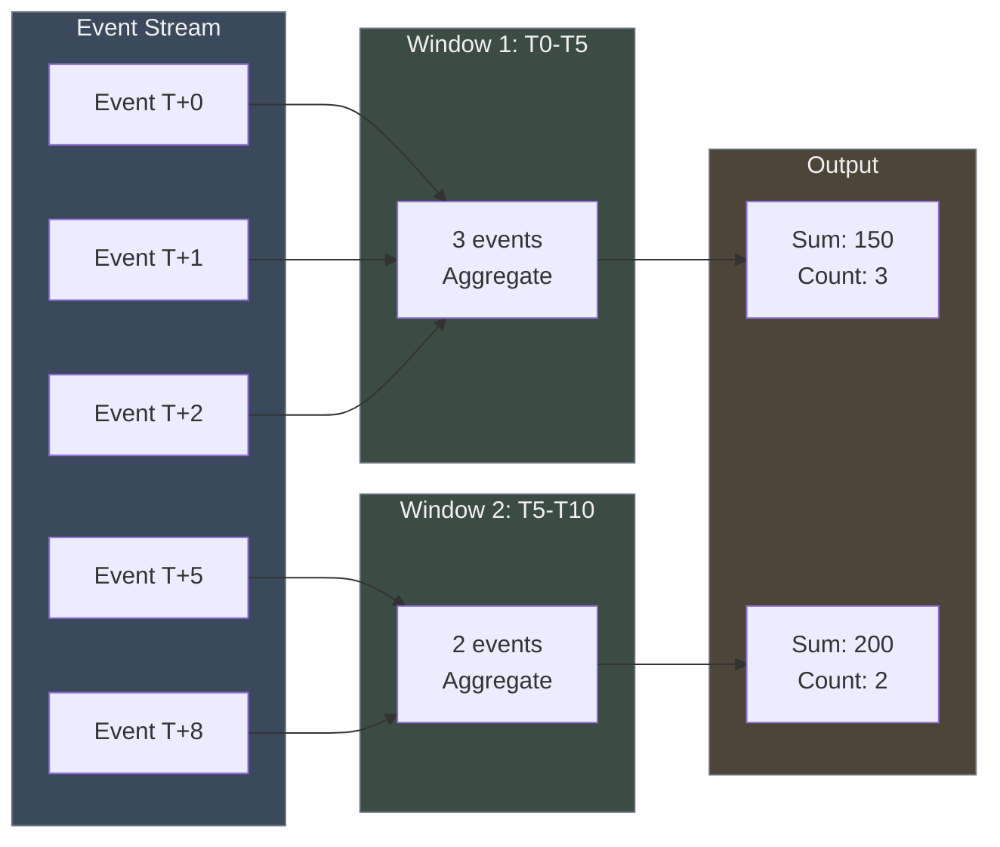

## 6. Schema Evolution Strategy

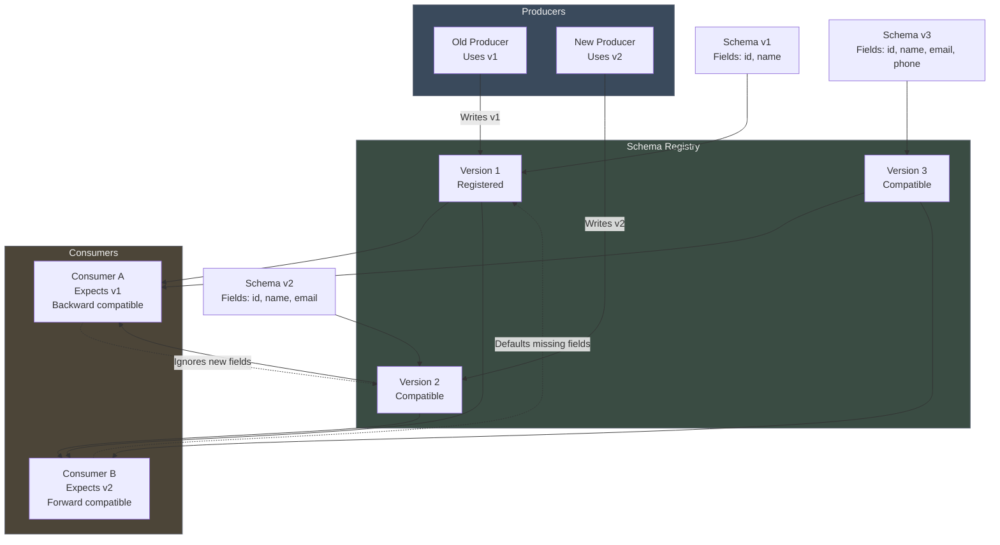

## 7. Log Aggregation Architecture

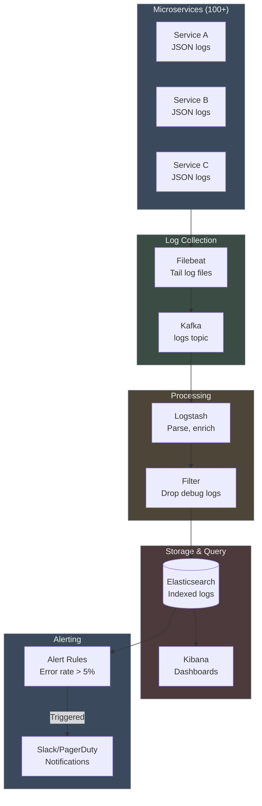

## 8. Idempotency Pattern

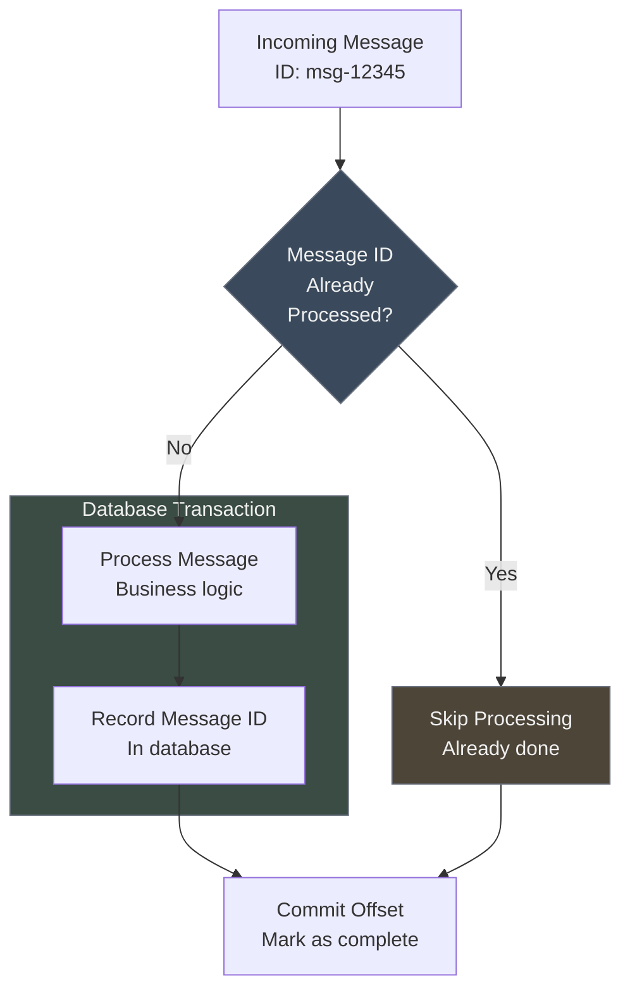

## 9. Batch vs Streaming Trade-offs

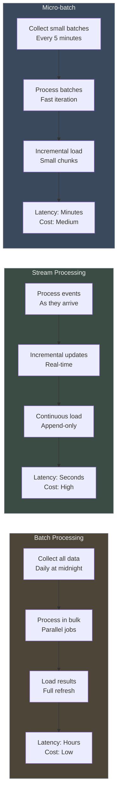

## 10. Monitoring Dashboard Metrics

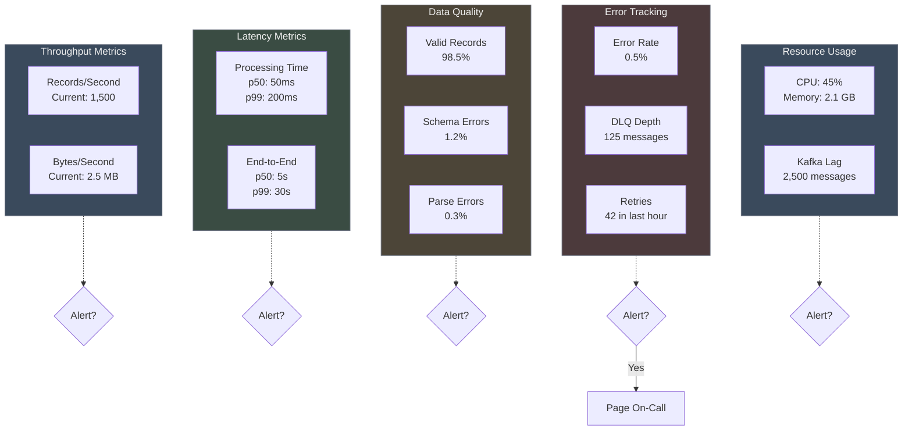

## 11. CDC (Change Data Capture) Pipeline

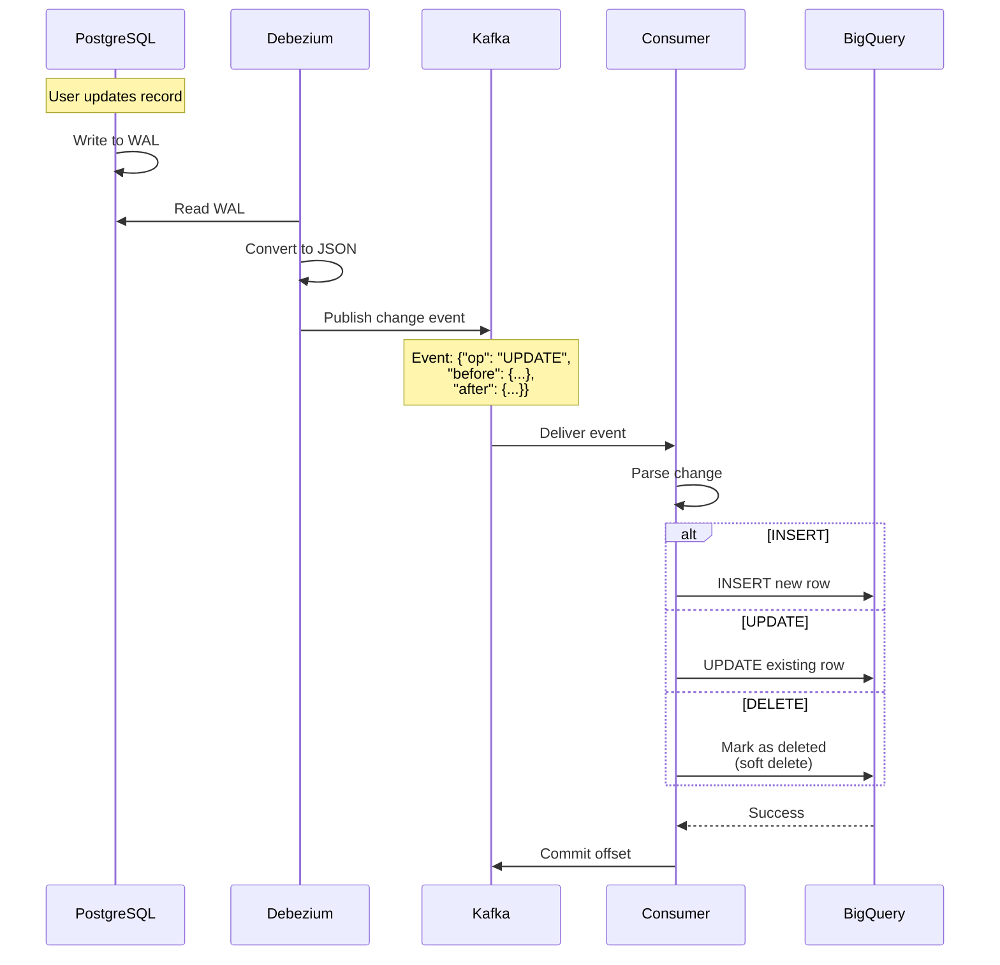

## 12. Airflow DAG Structure

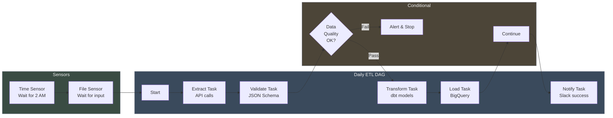
