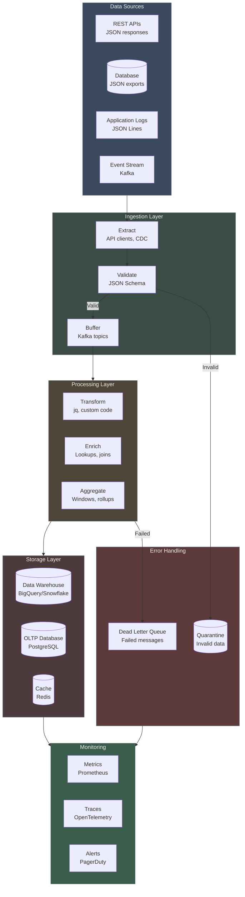
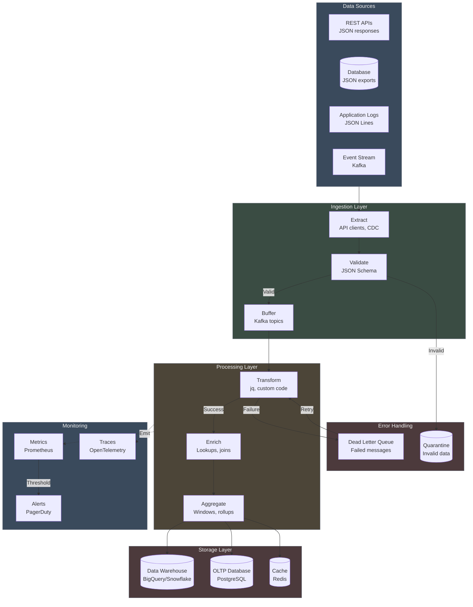
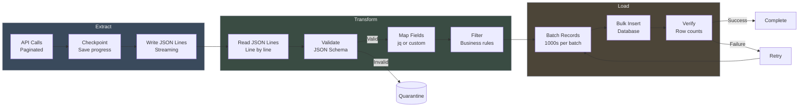
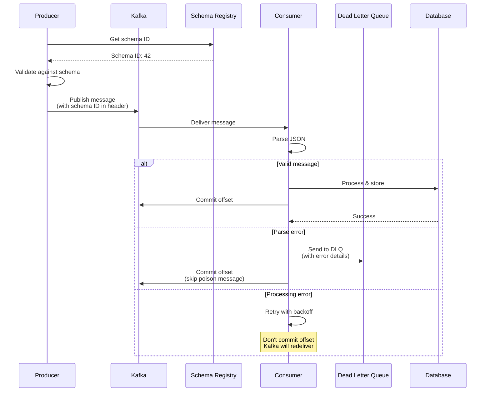
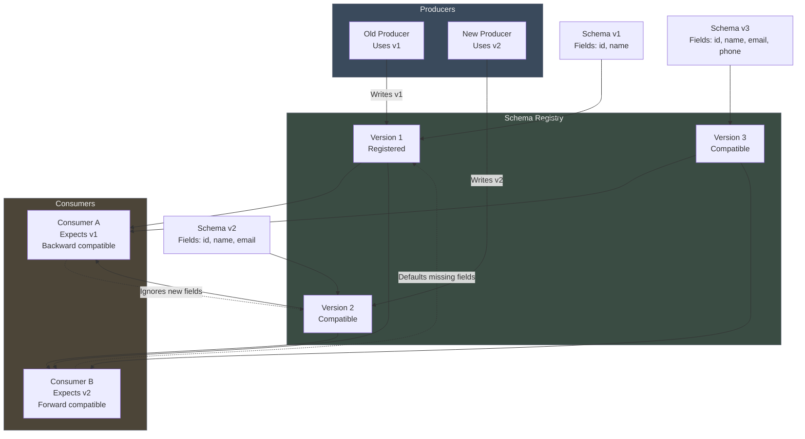
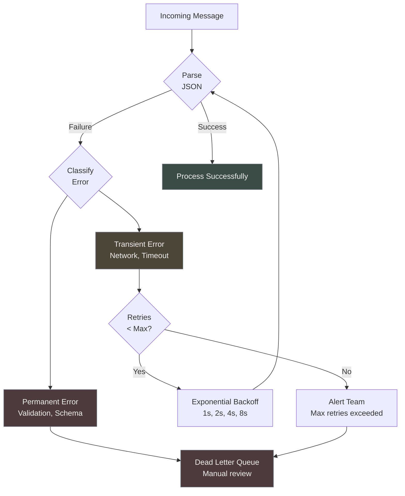
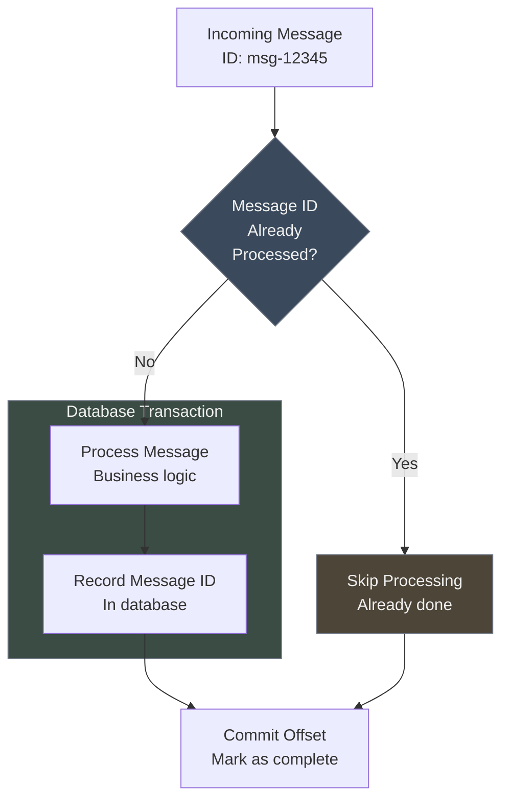
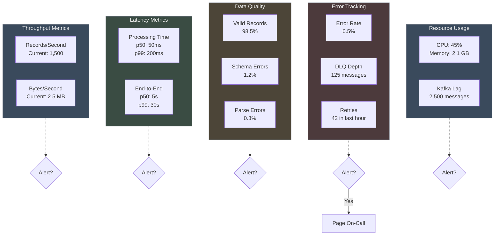
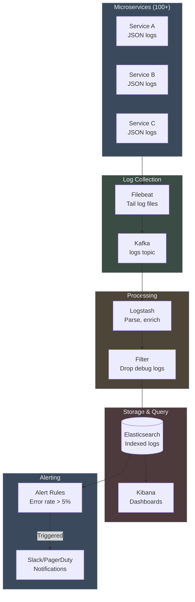
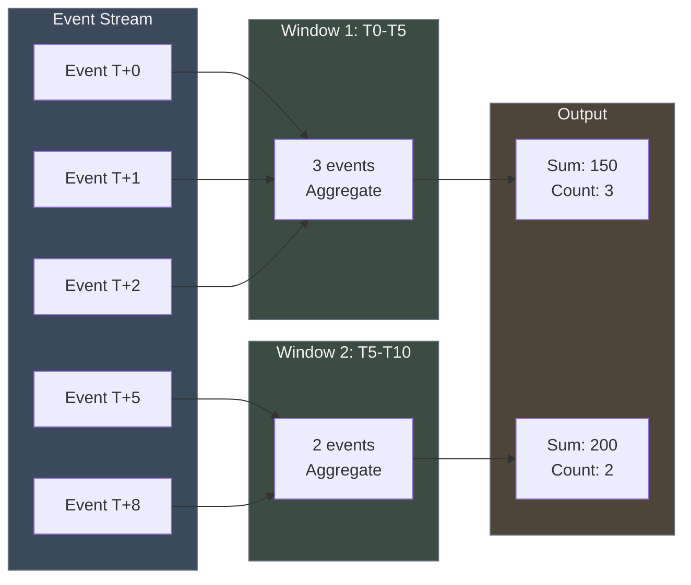

# Chapter 12: JSON in Data Pipelines

*JSON is everywhere in modern data systems--API responses, application logs, event streams, configuration files. But raw JSON isn't enough for production data pipelines. You need validation, transformation, error handling, monitoring, and orchestration at scale.*

---

JSON's success in APIs naturally extended to data engineering. When every microservice logs JSON, every API returns JSON, and every event system streams JSON, data pipelines become JSON-processing systems by necessity. But while JSON provides the syntax, building reliable data pipelines requires a sophisticated ecosystem of tools and patterns.

Consider this real-world scenario: An e-commerce company processes 1 million order events per day through their data pipeline. Each order is a JSON document flowing from checkout APIs through message queues to analytics databases. Everything works perfectly until one day:

```json
{"orderId": "12345", "amount": 99.99, "userId": "user123", "items": [
  {"productId": "prod-
```

A single malformed JSON record--network truncated during transmission--crashes their consumer. Without proper error handling, the entire pipeline backs up. Events pile in memory, the cluster exhausts resources, and six hours later they've lost $200,000 in revenue while engineers scramble to recover.

This chapter examines how to build production-grade JSON data pipelines that handle millions of events reliably. We'll cover the complete ecosystem: ETL patterns with JSON Lines, streaming with Kafka, validation strategies, error handling, monitoring, and real-world architectures that process JSON at scale.





## 1. ETL Fundamentals with JSON Lines

Extract-Transform-Load (ETL) remains the foundation of data engineering, but JSON introduces unique considerations. Unlike fixed schemas of traditional ETL, JSON's flexibility creates both opportunities and challenges for pipeline design.

### The JSON ETL Challenge

Traditional ETL assumes rigid schemas: you know exactly which columns exist and their types. JSON ETL deals with:
- **Schema evolution**: APIs add fields without warning
- **Nested data**: Complex hierarchies don't fit relational tables cleanly  
- **Missing fields**: Optional properties create sparse datasets
- **Type variations**: Numbers sometimes arrive as strings
- **Size variations**: Records range from bytes to megabytes

Building reliable JSON ETL requires handling these realities systematically.

### Extract Patterns

**API Extraction with Pagination:**

Most modern APIs return JSON with cursor or offset pagination. Extracting large datasets requires handling pagination state and checkpointing:

```javascript
// Robust API extraction to JSON Lines
async function extractFromAPI(baseUrl, outputPath) {
  const writer = fs.createWriteStream(outputPath);
  let page = 1;
  let hasMore = true;
  let totalRecords = 0;
  
  try {
    while (hasMore) {
      const response = await fetch(`${baseUrl}?page=${page}&limit=100`, {
        timeout: 30000,
        retry: 3
      });
      
      if (!response.ok) {
        throw new Error(`API error: ${response.status} ${response.statusText}`);
      }
      
      const data = await response.json();
      
      // Write each record as JSON Lines
      for (const record of data.items) {
        // Add extraction metadata
        const enriched = {
          ...record,
          _extracted_at: new Date().toISOString(),
          _source_page: page
        };
        writer.write(JSON.stringify(enriched) + '\n');
        totalRecords++;
      }
      
      hasMore = data.hasMore;
      page++;
      
      // Checkpoint progress for resume capability
      await saveCheckpoint({
        page, 
        totalRecords,
        timestamp: Date.now(),
        outputPath
      });
      
      console.log(`Extracted page ${page - 1}, total records: ${totalRecords}`);
    }
  } finally {
    writer.end();
  }
  
  return totalRecords;
}
```

**Database Extraction:**

PostgreSQL and other modern databases provide native JSON export capabilities:

```sql
-- Export table to JSON Lines
COPY (
  SELECT row_to_json(t)
  FROM (
    SELECT id, email, created_at, 
           metadata,
           created_at::text as created_date
    FROM users
    WHERE created_at >= '2024-01-01'
    ORDER BY id
  ) t
) TO '/tmp/users.jsonl';
```

**Log File Extraction:**

Application logs in JSON format require special handling for rotation and streaming:

```bash
# Extract JSON logs with jq filtering
find /var/log/app -name "*.log" -type f | \
while read logfile; do
  # Filter for error logs only
  jq 'select(.level == "error")' "$logfile" >> errors.jsonl
done
```

### Transform Patterns

**Field Mapping with jq:**

jq excels at transforming JSON structure for downstream systems:

```bash
# Transform user records for analytics
jq '{
  user_id: .id,
  email_domain: .email | split("@")[1],
  signup_date: .created_at | split("T")[0],
  country: .metadata.location.country // "unknown",
  is_premium: (.metadata.subscription.tier == "premium"),
  total_orders: .metadata.stats.order_count // 0
}' users.jsonl > analytics_users.jsonl
```

**Stream Transformation with Node.js:**

For complex transformations requiring business logic, streaming transforms provide memory efficiency:

```javascript
const { Transform } = require('stream');

class UserTransformer extends Transform {
  constructor(options = {}) {
    super({ objectMode: true });
    this.validate = ajv.compile(userSchema);
    this.stats = { valid: 0, invalid: 0, transformed: 0 };
    this.enrichmentCache = new Map();
  }
  
  async _transform(chunk, encoding, callback) {
    try {
      const record = JSON.parse(chunk);
      
      // Validate input
      if (!this.validate(record)) {
        this.stats.invalid++;
        this.emit('invalid', { 
          record, 
          errors: this.validate.errors,
          line: this.stats.valid + this.stats.invalid 
        });
        return callback();
      }
      
      this.stats.valid++;
      
      // Transform with enrichment
      const transformed = await this.transformRecord(record);
      this.stats.transformed++;
      
      // Output as JSON Lines
      this.push(JSON.stringify(transformed) + '\n');
      callback();
      
    } catch (error) {
      this.emit('error', error);
      callback(error);
    }
  }
  
  async transformRecord(record) {
    const transformed = {
      id: record.user_id,
      email: record.email.toLowerCase(),
      created: new Date(record.created_at).toISOString(),
      country: record.location?.country,
      tags: record.tags || []
    };
    
    // Enrich with external data (cached)
    if (transformed.email && !this.enrichmentCache.has(transformed.email)) {
      const enrichment = await this.lookupUserSegment(transformed.email);
      this.enrichmentCache.set(transformed.email, enrichment);
    }
    
    transformed.segment = this.enrichmentCache.get(transformed.email);
    
    return transformed;
  }
  
  async lookupUserSegment(email) {
    // External API call for user segmentation
    try {
      const response = await fetch(`https://api.segments.example.com/lookup?email=${email}`);
      const data = await response.json();
      return data.segment;
    } catch (error) {
      return 'unknown';
    }
  }
}

// Usage with error handling
const transformer = new UserTransformer();

transformer.on('invalid', (invalid) => {
  // Write invalid records to separate file for review
  fs.appendFileSync('invalid_users.jsonl', JSON.stringify(invalid) + '\n');
});

transformer.on('error', (error) => {
  console.error('Transform error:', error);
});

// Process file
fs.createReadStream('input.jsonl')
  .pipe(transformer)
  .pipe(fs.createWriteStream('output.jsonl'));
```

### Load Patterns

**BigQuery Loading:**

BigQuery provides native JSON Lines support with schema auto-detection:

```bash
# Load JSON Lines to BigQuery
bq load \
  --source_format=NEWLINE_DELIMITED_JSON \
  --autodetect \
  --max_bad_records=100 \
  --job_id="users_$(date +%s)" \
  analytics.users \
  users.jsonl
```

**PostgreSQL Loading with JSONB:**

PostgreSQL's JSONB support enables flexible JSON loading:

```sql
-- Create staging table for JSON Lines
CREATE TEMP TABLE json_staging (data jsonb);

-- Load JSON Lines
COPY json_staging(data) FROM '/path/to/users.jsonl';

-- Transform and insert into target schema
INSERT INTO users (id, email, created_at, metadata)
SELECT 
  (data->>'id')::uuid,
  data->>'email',
  (data->>'created_at')::timestamptz,
  data->'metadata'
FROM json_staging
WHERE data->>'id' IS NOT NULL; -- Filter out invalid records
```

**Python with Pandas:**

For analysis workflows, Pandas provides convenient JSON processing:

```python
import pandas as pd
import json

# Read JSON Lines efficiently
def read_jsonl(filepath):
    with open(filepath, 'r') as f:
        for line in f:
            yield json.loads(line)

# Convert to DataFrame with nested field normalization
df = pd.DataFrame(read_jsonl('users.jsonl'))

# Normalize nested JSON columns
metadata_df = pd.json_normalize(df['metadata'])
df = pd.concat([df.drop('metadata', axis=1), metadata_df], axis=1)

# Load to database
df.to_sql('users', engine, if_exists='append', index=False)
```

### Batch vs Streaming Trade-offs

| Dimension | Batch ETL | Streaming ETL |
|-----------|-----------|---------------|
| **Latency** | Minutes to hours | Seconds to minutes |
| **Complexity** | Lower (simpler error handling) | Higher (state management) |
| **Resource usage** | Burst (can use spot instances) | Constant (always-on resources) |
| **Error handling** | Retry entire batch | Individual record recovery |
| **Cost** | Lower (spot pricing) | Higher (persistent infrastructure) |
| **Ordering** | Natural (batch boundaries) | Complex (out-of-order arrival) |
| **Debugging** | Easier (replay batch) | Harder (streaming state) |

**When to choose batch:**
- Daily/hourly reporting requirements
- Large historical data loads  
- Cost optimization priority
- Simple transformations

**When to choose streaming:**
- Real-time dashboards
- Fraud detection
- Immediate data availability
- Event-driven architectures



This ETL foundation provides the building blocks for reliable JSON data processing. The next sections explore how these patterns scale to handle millions of JSON events through streaming systems like Kafka.

## 2. Kafka Integration for JSON Streaming

Apache Kafka transforms JSON pipelines from batch-oriented to stream-oriented architectures. Instead of processing files periodically, Kafka enables real-time processing of JSON events as they occur. This shift from "batch every hour" to "stream continuously" fundamentally changes how we design data systems.

### Why Kafka for JSON Pipelines

Kafka solves three critical problems for JSON data pipelines:

**1. Decoupling Producers and Consumers**
Without Kafka, your API server must wait for analytics processing to complete before responding. With Kafka, APIs publish JSON events immediately and continue serving requests while analytics systems process asynchronously.

**2. Fault Tolerance and Replay**  
File-based pipelines lose data when processes crash. Kafka persists JSON events for days or weeks, enabling replay from any point in time for recovery or reprocessing.

**3. Horizontal Scaling**
Single-machine ETL hits CPU and I/O limits. Kafka enables horizontal scaling by partitioning JSON streams across multiple consumer instances.



### JSON Message Production

**Node.js Producer with Error Handling:**

```javascript
const { Kafka } = require('kafkajs');

const kafka = new Kafka({
  clientId: 'order-producer',
  brokers: ['kafka1:9092', 'kafka2:9092', 'kafka3:9092']
});

const producer = kafka.producer({
  maxInFlightRequests: 1,  // Ensure ordering
  idempotent: true,        // Prevent duplicates
  transactionTimeout: 30000
});

class OrderProducer {
  constructor() {
    this.producer = producer;
    this.connected = false;
  }
  
  async connect() {
    await this.producer.connect();
    this.connected = true;
    console.log('Producer connected to Kafka');
  }
  
  async publishOrder(order) {
    if (!this.connected) {
      throw new Error('Producer not connected');
    }
    
    // Add metadata to JSON message
    const message = {
      ...order,
      timestamp: Date.now(),
      source: 'order-service',
      version: '2.0'
    };
    
    try {
      await this.producer.send({
        topic: 'orders',
        messages: [{
          key: order.id,  // Partition by order ID
          value: JSON.stringify(message),
          headers: {
            'content-type': 'application/json',
            'schema-version': '2.0',
            'source-service': 'order-api'
          },
          timestamp: Date.now().toString()
        }]
      });
      
      console.log(`Published order ${order.id}`);
    } catch (error) {
      console.error(`Failed to publish order ${order.id}:`, error);
      throw error;
    }
  }
  
  async disconnect() {
    await this.producer.disconnect();
    this.connected = false;
  }
}

// Usage in API endpoint
app.post('/orders', async (req, res) => {
  const order = req.body;
  
  try {
    // Save to database first
    await db.orders.create(order);
    
    // Then publish to Kafka (fire-and-forget for API speed)
    orderProducer.publishOrder(order).catch(err => {
      console.error('Async Kafka publish failed:', err);
      // Could implement retry queue here
    });
    
    res.status(201).json({orderId: order.id});
  } catch (error) {
    res.status(500).json({error: 'Order creation failed'});
  }
});
```

### JSON Message Consumption

**Go Consumer with Robust Error Handling:**

```go
package main

import (
    "context"
    "encoding/json"
    "fmt"
    "log"
    "time"
    
    "github.com/confluentinc/confluent-kafka-go/kafka"
)

type Order struct {
    ID       string  `json:"id"`
    UserID   string  `json:"userId"`
    Amount   float64 `json:"amount"`
    Items    []Item  `json:"items"`
    Created  string  `json:"timestamp"`
}

type Item struct {
    ProductID string  `json:"productId"`
    Quantity  int     `json:"quantity"`
    Price     float64 `json:"price"`
}

type OrderProcessor struct {
    consumer *kafka.Consumer
    dlqProducer *kafka.Producer
    metrics  *Metrics
}

func NewOrderProcessor() (*OrderProcessor, error) {
    consumer, err := kafka.NewConsumer(&kafka.ConfigMap{
        "bootstrap.servers": "kafka1:9092,kafka2:9092",
        "group.id":          "order-processor",
        "auto.offset.reset": "latest",
        "enable.auto.commit": false,  // Manual commit for reliability
    })
    if err != nil {
        return nil, err
    }
    
    dlqProducer, err := kafka.NewProducer(&kafka.ConfigMap{
        "bootstrap.servers": "kafka1:9092,kafka2:9092",
    })
    if err != nil {
        return nil, err
    }
    
    return &OrderProcessor{
        consumer: consumer,
        dlqProducer: dlqProducer,
        metrics: NewMetrics(),
    }, nil
}

func (p *OrderProcessor) ProcessMessages(ctx context.Context) error {
    err := p.consumer.Subscribe("orders", nil)
    if err != nil {
        return err
    }
    
    for {
        select {
        case <-ctx.Done():
            return ctx.Err()
        default:
            msg, err := p.consumer.ReadMessage(time.Second)
            if err != nil {
                if err.(kafka.Error).Code() == kafka.ErrTimedOut {
                    continue
                }
                log.Printf("Consumer error: %v", err)
                continue
            }
            
            if err := p.processMessage(msg); err != nil {
                log.Printf("Processing failed for message %s: %v", 
                    string(msg.Key), err)
                
                // Send to DLQ
                p.sendToDLQ(msg, err)
            }
            
            // Commit offset only after successful processing
            p.consumer.CommitMessage(msg)
        }
    }
}

func (p *OrderProcessor) processMessage(msg *kafka.Message) error {
    var order Order
    if err := json.Unmarshal(msg.Value, &order); err != nil {
        p.metrics.InvalidJSON.Inc()
        return fmt.Errorf("invalid JSON: %w", err)
    }
    
    // Validate required fields
    if order.ID == "" || order.UserID == "" {
        p.metrics.ValidationFailed.Inc()
        return fmt.Errorf("missing required fields")
    }
    
    // Process business logic
    if err := p.processOrder(order); err != nil {
        p.metrics.ProcessingFailed.Inc()
        return fmt.Errorf("business logic failed: %w", err)
    }
    
    p.metrics.Processed.Inc()
    return nil
}

func (p *OrderProcessor) processOrder(order Order) error {
    // Update inventory
    for _, item := range order.Items {
        if err := updateInventory(item.ProductID, -item.Quantity); err != nil {
            return err
        }
    }
    
    // Update analytics
    if err := updateUserAnalytics(order.UserID, order.Amount); err != nil {
        return err
    }
    
    // Send notification
    if err := sendOrderNotification(order); err != nil {
        // Non-fatal error - log but don't fail
        log.Printf("Notification failed for order %s: %v", order.ID, err)
    }
    
    return nil
}

func (p *OrderProcessor) sendToDLQ(msg *kafka.Message, err error) {
    dlqMessage := &kafka.Message{
        TopicPartition: kafka.TopicPartition{
            Topic:     stringPtr("orders-dlq"),
            Partition: kafka.PartitionAny,
        },
        Key:   msg.Key,
        Value: msg.Value,
        Headers: []kafka.Header{
            {Key: "error", Value: []byte(err.Error())},
            {Key: "original-topic", Value: []byte(*msg.TopicPartition.Topic)},
            {Key: "failed-at", Value: []byte(time.Now().Format(time.RFC3339))},
        },
    }
    
    if err := p.dlqProducer.Produce(dlqMessage, nil); err != nil {
        log.Printf("Failed to send message to DLQ: %v", err)
    }
}
```

### Format Comparison: JSON vs Avro vs Protobuf

In production Kafka deployments, you can choose different serialization formats:

| Format | Schema Required | Size Efficiency | Speed | Evolution Support | JSON Compatibility |
|--------|-----------------|-----------------|-------|-------------------|-------------------|
| **JSON** | No | Poorest (text) | Slowest | Easy (additive) | Native |
| **Avro** | Yes | Good (compact) | Fast | Schema Registry | Via conversion |
| **Protobuf** | Yes | Best (binary) | Fastest | Versioned fields | Via conversion |

**When to use JSON:**
```javascript
// Development, debugging, maximum flexibility
const jsonMessage = {
  orderId: "12345",
  amount: 99.99,
  debug: true  // Can add any field
};

producer.send({
  topic: 'orders',
  value: JSON.stringify(jsonMessage)
});
```

**When to upgrade to Avro:**
```javascript
// Production with schema registry
const schema = {
  type: 'record',
  name: 'Order',
  fields: [
    {name: 'orderId', type: 'string'},
    {name: 'amount', type: 'double'},
    {name: 'userId', type: 'string'}
  ]
};

const schemaRegistry = new SchemaRegistry({host: 'http://schema-registry:8081'});

// Automatic schema validation and evolution
const encoded = await schemaRegistry.encode(schema, order);
producer.send({topic: 'orders', value: encoded});
```

### Schema Registry Integration

Schema Registry provides centralized schema management for evolving JSON message formats:

```javascript
// Producer with schema registration
class SchemaAwareProducer {
  constructor() {
    this.registry = new SchemaRegistry({
      host: 'http://schema-registry:8081'
    });
    this.schemas = new Map();
  }
  
  async publishWithSchema(topic, message, schemaVersion = 'latest') {
    let schema = this.schemas.get(`${topic}-${schemaVersion}`);
    
    if (!schema) {
      schema = await this.registry.getLatestSchemaMetadata(topic + '-value');
      this.schemas.set(`${topic}-${schemaVersion}`, schema);
    }
    
    // Validate message against schema
    const valid = ajv.compile(JSON.parse(schema.schema))(message);
    if (!valid) {
      throw new Error('Message validation failed');
    }
    
    // Encode with schema ID
    const encoded = await this.registry.encode(schema.id, message);
    
    await this.producer.send({
      topic,
      value: encoded
    });
  }
}
```



### Monitoring Kafka JSON Pipelines

**Producer Metrics:**
```javascript
const prometheus = require('prom-client');

const producerMetrics = {
  messagesProduced: new prometheus.Counter({
    name: 'kafka_messages_produced_total',
    labelNames: ['topic']
  }),
  
  productionLatency: new prometheus.Histogram({
    name: 'kafka_production_duration_seconds',
    labelNames: ['topic'],
    buckets: [0.001, 0.01, 0.1, 0.5, 1, 2, 5]
  }),
  
  productionErrors: new prometheus.Counter({
    name: 'kafka_production_errors_total',
    labelNames: ['topic', 'error_type']
  })
};

// Instrument producer
const originalSend = producer.send;
producer.send = async function(message) {
  const start = Date.now();
  
  try {
    const result = await originalSend.call(this, message);
    
    producerMetrics.messagesProduced
      .labels(message.topic)
      .inc();
      
    producerMetrics.productionLatency
      .labels(message.topic)
      .observe((Date.now() - start) / 1000);
      
    return result;
  } catch (error) {
    producerMetrics.productionErrors
      .labels(message.topic, error.constructor.name)
      .inc();
    throw error;
  }
};
```

**Consumer Lag Monitoring:**
```javascript
// Monitor consumer lag
async function monitorConsumerLag() {
  const admin = kafka.admin();
  
  try {
    const offsets = await admin.fetchOffsets({
      groupId: 'order-processor',
      topic: 'orders'
    });
    
    for (const partition of offsets.topics[0].partitions) {
      const lag = partition.high - partition.offset;
      
      consumerLagGauge
        .labels('orders', partition.partition.toString())
        .set(lag);
        
      if (lag > 10000) {
        alerting.trigger('high-consumer-lag', {
          topic: 'orders',
          partition: partition.partition,
          lag: lag
        });
      }
    }
  } catch (error) {
    console.error('Failed to check consumer lag:', error);
  }
}

setInterval(monitorConsumerLag, 60000); // Check every minute
```


This Kafka integration provides the foundation for real-time JSON processing at scale. The streaming approach enables immediate processing of events as they occur, supporting use cases like real-time analytics, fraud detection, and live dashboards that batch ETL cannot achieve.

## 3. Data Validation in Pipelines

Data validation becomes critical in JSON pipelines because flexibility enables inconsistency. Unlike strongly-typed systems where invalid data fails at compile time, JSON allows any structure to pass through until it breaks downstream processing. Production pipelines require multiple validation layers to catch problems early and handle them gracefully.

### The Validation Problem

Consider these variations of the same user event that might arrive in your pipeline:

```json
// Valid event
{"userId": "12345", "action": "login", "timestamp": "2024-01-15T10:30:00Z"}

// Missing required field
{"userId": "12345", "timestamp": "2024-01-15T10:30:00Z"}

// Wrong data type
{"userId": 12345, "action": "login", "timestamp": "2024-01-15T10:30:00Z"}

// Invalid timestamp format
{"userId": "12345", "action": "login", "timestamp": "Jan 15, 2024"}

// Nested complexity
{"user": {"id": "12345"}, "event": {"type": "login", "when": "2024-01-15T10:30:00Z"}}
```

Without validation, these variations cause different failure modes:
- Missing fields crash aggregations
- Type mismatches break analytics queries  
- Invalid formats corrupt time-series data
- Schema drift breaks downstream consumers

### Validation at Ingestion

The earliest validation point is when data enters your pipeline:

```javascript
// API ingestion with validation
const Ajv = require('ajv');
const addFormats = require('ajv-formats');

const ajv = new Ajv({allErrors: true});
addFormats(ajv);

// Define strict event schema
const eventSchema = {
  type: 'object',
  required: ['userId', 'action', 'timestamp'],
  additionalProperties: false,  // Reject unknown fields
  properties: {
    userId: {
      type: 'string',
      pattern: '^[0-9]+$',
      minLength: 1,
      maxLength: 20
    },
    action: {
      type: 'string',
      enum: ['login', 'logout', 'purchase', 'view', 'search']
    },
    timestamp: {
      type: 'string',
      format: 'date-time'
    },
    metadata: {
      type: 'object',
      properties: {
        ip: {type: 'string', format: 'ipv4'},
        userAgent: {type: 'string', maxLength: 500}
      }
    }
  }
};

const validateEvent = ajv.compile(eventSchema);

app.post('/events', async (req, res) => {
  // Validate at the API boundary
  const valid = validateEvent(req.body);
  
  if (!valid) {
    // Return detailed validation errors
    const errors = validateEvent.errors.map(error => ({
      field: error.instancePath || error.params?.missingProperty,
      message: error.message,
      rejectedValue: error.data
    }));
    
    // Log validation failures for monitoring
    logger.warn('Event validation failed', {
      errors,
      event: req.body,
      source: req.ip
    });
    
    return res.status(400).json({
      error: 'Validation failed',
      details: errors
    });
  }
  
  // Add validation metadata
  const enrichedEvent = {
    ...req.body,
    _validated_at: new Date().toISOString(),
    _schema_version: '1.0'
  };
  
  // Publish to Kafka for downstream processing
  await eventProducer.publish('user-events', enrichedEvent);
  
  res.status(202).json({accepted: true});
});
```

### Stream Validation with Quarantine

For streaming pipelines, invalid data should be quarantined rather than blocking processing:

```javascript
const { Transform } = require('stream');

class ValidatingTransform extends Transform {
  constructor(schema, options = {}) {
    super({objectMode: true});
    this.validate = ajv.compile(schema);
    this.quarantineStream = options.quarantineStream;
    this.stats = {
      valid: 0,
      invalid: 0,
      quarantined: 0
    };
  }
  
  _transform(chunk, encoding, callback) {
    try {
      const record = JSON.parse(chunk);
      
      if (this.validate(record)) {
        // Valid record - pass through
        this.stats.valid++;
        this.push(JSON.stringify(record) + '\n');
      } else {
        // Invalid record - quarantine
        this.stats.invalid++;
        this.quarantineRecord(record, this.validate.errors);
      }
      
    } catch (error) {
      // JSON parse error - quarantine
      this.stats.invalid++;
      this.quarantineRecord(chunk.toString(), [{
        message: 'Invalid JSON',
        error: error.message
      }]);
    }
    
    callback();
  }
  
  quarantineRecord(record, errors) {
    const quarantineEntry = {
      record: typeof record === 'string' ? record : record,
      errors: errors,
      timestamp: new Date().toISOString(),
      source: 'validation'
    };
    
    if (this.quarantineStream) {
      this.quarantineStream.write(JSON.stringify(quarantineEntry) + '\n');
      this.stats.quarantined++;
    }
    
    // Emit metric for monitoring
    this.emit('invalid', {record, errors});
  }
}

// Usage with quarantine file
const quarantineStream = fs.createWriteStream('quarantine.jsonl');
const validator = new ValidatingTransform(eventSchema, {quarantineStream});

validator.on('invalid', (data) => {
  console.warn('Invalid record quarantined:', data.errors[0].message);
});

fs.createReadStream('events.jsonl')
  .pipe(validator)
  .pipe(fs.createWriteStream('valid_events.jsonl'));
```

### Schema Drift Detection

Detecting when data structure changes unexpectedly:

```javascript
// Schema drift monitoring
class SchemaDriftDetector {
  constructor(expectedSchema) {
    this.expectedFields = new Set(Object.keys(expectedSchema.properties || {}));
    this.observedFields = new Map();
    this.driftAlerts = new Map();
  }
  
  analyzeRecord(record) {
    const recordFields = new Set(this.getFieldPaths(record));
    
    // Track field frequency
    for (const field of recordFields) {
      this.observedFields.set(field, (this.observedFields.get(field) || 0) + 1);
    }
    
    // Detect new fields (potential drift)
    const newFields = [...recordFields].filter(f => !this.expectedFields.has(f));
    
    if (newFields.length > 0) {
      for (const field of newFields) {
        const count = this.observedFields.get(field);
        
        // Alert if new field appears in >5% of records
        if (count > 0 && count % 100 === 0) {
          const percentage = (count / this.getTotalRecords()) * 100;
          
          if (percentage > 5 && !this.driftAlerts.has(field)) {
            this.alertSchemaDrift(field, percentage, record);
            this.driftAlerts.set(field, true);
          }
        }
      }
    }
    
    // Detect missing expected fields
    const missingFields = [...this.expectedFields].filter(f => !recordFields.has(f));
    if (missingFields.length > 0) {
      this.alertMissingFields(missingFields, record);
    }
  }
  
  getFieldPaths(obj, prefix = '') {
    const paths = [];
    
    for (const [key, value] of Object.entries(obj)) {
      const path = prefix ? `${prefix}.${key}` : key;
      paths.push(path);
      
      if (value && typeof value === 'object' && !Array.isArray(value)) {
        paths.push(...this.getFieldPaths(value, path));
      }
    }
    
    return paths;
  }
  
  alertSchemaDrift(field, percentage, sampleRecord) {
    console.warn(`Schema drift detected: New field '${field}' in ${percentage}% of records`);
    
    // Send to monitoring system
    metrics.schemaDrift.inc({
      field: field,
      percentage: percentage.toFixed(1)
    });
    
    // Log sample record for investigation
    logger.warn('Schema drift sample', {
      newField: field,
      sampleRecord: sampleRecord,
      percentage: percentage
    });
  }
  
  getTotalRecords() {
    return Array.from(this.observedFields.values()).reduce((a, b) => a + b, 0);
  }
}
```

### Data Quality Metrics

Track validation success rates and common failure patterns:

```javascript
const prometheus = require('prom-client');

const dataQualityMetrics = {
  recordsProcessed: new prometheus.Counter({
    name: 'pipeline_records_processed_total',
    labelNames: ['source', 'status']
  }),
  
  validationErrors: new prometheus.Counter({
    name: 'pipeline_validation_errors_total',
    labelNames: ['error_type', 'field']
  }),
  
  dataQualityScore: new prometheus.Gauge({
    name: 'pipeline_data_quality_percent',
    labelNames: ['source']
  }),
  
  schemaDrift: new prometheus.Counter({
    name: 'pipeline_schema_drift_total',
    labelNames: ['field', 'source']
  })
};

class DataQualityTracker {
  constructor(source) {
    this.source = source;
    this.windowSize = 1000;
    this.window = {
      valid: 0,
      invalid: 0,
      errors: new Map()
    };
  }
  
  recordValidation(isValid, errors = []) {
    if (isValid) {
      this.window.valid++;
      dataQualityMetrics.recordsProcessed
        .labels(this.source, 'valid')
        .inc();
    } else {
      this.window.invalid++;
      dataQualityMetrics.recordsProcessed
        .labels(this.source, 'invalid')
        .inc();
        
      // Track error patterns
      for (const error of errors) {
        const key = `${error.field}:${error.message}`;
        this.window.errors.set(key, (this.window.errors.get(key) || 0) + 1);
        
        dataQualityMetrics.validationErrors
          .labels(error.message, error.field || 'unknown')
          .inc();
      }
    }
    
    // Calculate quality score every window
    const total = this.window.valid + this.window.invalid;
    if (total >= this.windowSize) {
      const qualityScore = (this.window.valid / total) * 100;
      
      dataQualityMetrics.dataQualityScore
        .labels(this.source)
        .set(qualityScore);
        
      // Alert on low quality
      if (qualityScore < 95) {
        this.alertLowQuality(qualityScore);
      }
      
      this.resetWindow();
    }
  }
  
  alertLowQuality(score) {
    const topErrors = Array.from(this.window.errors.entries())
      .sort(([,a], [,b]) => b - a)
      .slice(0, 5);
      
    logger.error('Data quality below threshold', {
      source: this.source,
      qualityScore: score.toFixed(2),
      topErrors: topErrors
    });
  }
  
  resetWindow() {
    this.window = {
      valid: 0,
      invalid: 0,
      errors: new Map()
    };
  }
}
```

### Contextual Validation

Beyond schema validation, implement business logic validation:

```javascript
class BusinessRuleValidator {
  constructor() {
    this.rules = new Map();
    this.defineRules();
  }
  
  defineRules() {
    // Age validation
    this.rules.set('user.age', (value) => {
      if (value < 0 || value > 150) {
        return {valid: false, message: 'Age must be between 0 and 150'};
      }
      return {valid: true};
    });
    
    // Email domain whitelist
    this.rules.set('user.email', (value) => {
      const allowedDomains = ['gmail.com', 'company.com', 'university.edu'];
      const domain = value.split('@')[1];
      
      if (!allowedDomains.includes(domain)) {
        return {valid: false, message: `Email domain ${domain} not allowed`};
      }
      return {valid: true};
    });
    
    // Purchase amount limits
    this.rules.set('order.amount', (value, context) => {
      const userTier = context.user?.tier || 'basic';
      const limits = {basic: 1000, premium: 10000, enterprise: 100000};
      
      if (value > limits[userTier]) {
        return {valid: false, message: `Amount exceeds ${userTier} tier limit`};
      }
      return {valid: true};
    });
    
    // Time window validation
    this.rules.set('event.timestamp', (value) => {
      const eventTime = new Date(value);
      const now = new Date();
      const hourAgo = new Date(now.getTime() - 60 * 60 * 1000);
      
      if (eventTime > now || eventTime < hourAgo) {
        return {valid: false, message: 'Event timestamp outside allowed window'};
      }
      return {valid: true};
    });
  }
  
  validate(record, context = {}) {
    const errors = [];
    
    for (const [path, rule] of this.rules) {
      const value = this.getValueAtPath(record, path);
      
      if (value !== undefined) {
        const result = rule(value, {...context, record});
        
        if (!result.valid) {
          errors.push({
            field: path,
            message: result.message,
            value: value
          });
        }
      }
    }
    
    return {
      valid: errors.length === 0,
      errors: errors
    };
  }
  
  getValueAtPath(obj, path) {
    return path.split('.').reduce((current, key) => 
      current && current[key], obj
    );
  }
}

// Usage in pipeline
const businessValidator = new BusinessRuleValidator();

function validateRecord(record, context) {
  // First: Schema validation
  const schemaValid = validateEvent(record);
  if (!schemaValid) {
    return {valid: false, errors: validateEvent.errors, type: 'schema'};
  }
  
  // Second: Business rules validation
  const businessValid = businessValidator.validate(record, context);
  if (!businessValid.valid) {
    return {valid: false, errors: businessValid.errors, type: 'business'};
  }
  
  return {valid: true};
}
```

This multi-layered validation approach ensures data quality while providing graceful degradation when validation fails. The quarantine pattern prevents invalid data from corrupting downstream systems while preserving it for investigation and potential reprocessing after fixes.

## 4. Error Handling and Resilience

JSON pipelines fail in many ways: malformed data, network timeouts, downstream service unavailability, resource exhaustion, and configuration errors. Production pipelines must handle these failures gracefully, distinguishing between permanent failures that require human intervention and transient failures that can be retried automatically.

### Failure Classification

Not all errors are equal. The handling strategy depends on the error type:

```javascript
function classifyError(error, context = {}) {
  // Permanent failures - don't retry
  const permanentErrors = [
    'ValidationError',
    'SyntaxError',           // Malformed JSON
    'SchemaError',           // JSON Schema validation
    'AuthenticationError',   // Invalid credentials
    'AuthorizationError',    // Insufficient permissions
    'ConfigurationError'     // Wrong configuration
  ];
  
  // Transient failures - retry with backoff
  const transientErrors = [
    'TimeoutError',
    'NetworkError',
    'ConnectionError',
    'ServiceUnavailableError',
    'RateLimitError',
    'TemporaryDatabaseError'
  ];
  
  // Resource exhaustion - might be transient
  const resourceErrors = [
    'OutOfMemoryError',
    'DiskSpaceError',
    'TooManyOpenFilesError'
  ];
  
  const errorName = error.constructor.name || error.name;
  
  if (permanentErrors.includes(errorName)) {
    return {
      type: 'PERMANENT',
      shouldRetry: false,
      shouldQuarantine: true,
      description: 'Requires human intervention'
    };
  }
  
  if (transientErrors.includes(errorName)) {
    return {
      type: 'TRANSIENT',
      shouldRetry: true,
      shouldQuarantine: false,
      description: 'Likely recoverable with retry'
    };
  }
  
  if (resourceErrors.includes(errorName)) {
    return {
      type: 'RESOURCE',
      shouldRetry: true,
      shouldQuarantine: false,
      backoffMultiplier: 2, // Slower retry
      description: 'Resource exhaustion - retry with caution'
    };
  }
  
  // Unknown errors - treat as transient for safety
  return {
    type: 'UNKNOWN',
    shouldRetry: true,
    shouldQuarantine: true, // Preserve for investigation
    description: 'Unknown error type - retry and quarantine'
  };
}
```



### Exponential Backoff with Jitter

Transient failures should be retried with increasing delays to avoid overwhelming failed services:

```javascript
class RetryManager {
  constructor(options = {}) {
    this.maxRetries = options.maxRetries || 5;
    this.baseDelayMs = options.baseDelayMs || 1000;
    this.maxDelayMs = options.maxDelayMs || 30000;
    this.jitterRatio = options.jitterRatio || 0.2;
  }
  
  async executeWithRetry(operation, context = {}) {
    let lastError;
    
    for (let attempt = 0; attempt <= this.maxRetries; attempt++) {
      try {
        const result = await operation();
        
        // Success - log if this was a retry
        if (attempt > 0) {
          logger.info('Operation succeeded after retry', {
            attempts: attempt + 1,
            context: context
          });
        }
        
        return result;
        
      } catch (error) {
        lastError = error;
        
        const classification = classifyError(error, context);
        
        if (!classification.shouldRetry) {
          // Permanent error - don't retry
          throw new PermanentError(`Permanent failure: ${error.message}`, error);
        }
        
        if (attempt === this.maxRetries) {
          // Max retries exceeded
          throw new MaxRetriesExceededError(
            `Failed after ${this.maxRetries + 1} attempts: ${error.message}`,
            error,
            attempt + 1
          );
        }
        
        // Calculate delay with exponential backoff and jitter
        const baseDelay = Math.min(
          this.baseDelayMs * Math.pow(2, attempt),
          this.maxDelayMs
        );
        
        // Add jitter to prevent thundering herd
        const jitter = baseDelay * this.jitterRatio * (Math.random() - 0.5);
        const delayMs = Math.max(0, baseDelay + jitter);
        
        logger.warn(`Retrying operation after error`, {
          attempt: attempt + 1,
          maxRetries: this.maxRetries,
          delayMs: Math.round(delayMs),
          error: error.message,
          context: context
        });
        
        // Wait before retry
        await this.delay(delayMs);
      }
    }
    
    throw lastError;
  }
  
  delay(ms) {
    return new Promise(resolve => setTimeout(resolve, ms));
  }
}

// Custom error types for better error handling
class PermanentError extends Error {
  constructor(message, originalError) {
    super(message);
    this.name = 'PermanentError';
    this.originalError = originalError;
    this.isPermanent = true;
  }
}

class MaxRetriesExceededError extends Error {
  constructor(message, originalError, attempts) {
    super(message);
    this.name = 'MaxRetriesExceededError';
    this.originalError = originalError;
    this.attempts = attempts;
  }
}
```

### Dead Letter Queue Pattern

Failed messages need systematic handling to prevent data loss:

```javascript
class DeadLetterQueue {
  constructor(options = {}) {
    this.dlqProducer = options.producer; // Kafka producer for DLQ
    this.dlqTopic = options.topic || 'dead-letter-queue';
    this.maxRetries = options.maxRetries || 3;
    this.retryDelays = options.retryDelays || [1000, 5000, 15000]; // ms
  }
  
  async processWithDLQ(message, processor, context = {}) {
    let lastError;
    
    for (let attempt = 0; attempt < this.maxRetries; attempt++) {
      try {
        await processor(message);
        return; // Success
        
      } catch (error) {
        lastError = error;
        
        const classification = classifyError(error, context);
        
        if (!classification.shouldRetry) {
          // Permanent error - send to DLQ immediately
          await this.sendToDLQ(message, error, {
            reason: 'permanent_failure',
            attempts: attempt + 1,
            classification: classification
          });
          return;
        }
        
        // Wait before retry
        if (attempt < this.maxRetries - 1) {
          await this.delay(this.retryDelays[attempt] || 15000);
        }
      }
    }
    
    // Max retries exceeded - send to DLQ
    await this.sendToDLQ(message, lastError, {
      reason: 'max_retries_exceeded',
      attempts: this.maxRetries,
      classification: classifyError(lastError, context)
    });
  }
  
  async sendToDLQ(originalMessage, error, metadata) {
    const dlqMessage = {
      originalMessage: originalMessage,
      error: {
        name: error.name,
        message: error.message,
        stack: error.stack
      },
      metadata: {
        ...metadata,
        failedAt: new Date().toISOString(),
        originalTopic: originalMessage.topic,
        originalPartition: originalMessage.partition,
        originalOffset: originalMessage.offset
      }
    };
    
    try {
      await this.dlqProducer.send({
        topic: this.dlqTopic,
        key: originalMessage.key,
        value: JSON.stringify(dlqMessage),
        headers: {
          'dlq-reason': metadata.reason,
          'original-topic': originalMessage.topic || '',
          'error-type': error.name,
          'failed-at': new Date().toISOString()
        }
      });
      
      logger.info('Message sent to DLQ', {
        originalKey: originalMessage.key,
        reason: metadata.reason,
        attempts: metadata.attempts
      });
      
    } catch (dlqError) {
      // Critical: DLQ send failed - escalate
      logger.error('CRITICAL: Failed to send message to DLQ', {
        originalMessage,
        dlqError: dlqError.message,
        originalError: error.message
      });
      
      // Could write to local file as last resort
      await this.writeToLocalDLQ(dlqMessage);
    }
  }
  
  async writeToLocalDLQ(dlqMessage) {
    const fs = require('fs').promises;
    const filename = `dlq-${Date.now()}.jsonl`;
    
    try {
      await fs.appendFile(filename, JSON.stringify(dlqMessage) + '\n');
      logger.warn(`Message written to local DLQ file: ${filename}`);
    } catch (fileError) {
      logger.error('Failed to write to local DLQ', fileError);
    }
  }
  
  delay(ms) {
    return new Promise(resolve => setTimeout(resolve, ms));
  }
}
```

### Idempotent Processing

Processing the same message multiple times should be safe:



```javascript
class IdempotentProcessor {
  constructor(options = {}) {
    this.redis = options.redis;
    this.keyPrefix = options.keyPrefix || 'processed:';
    this.ttlSeconds = options.ttlSeconds || 86400; // 24 hours
  }
  
  async processIdempotently(messageId, processor, message) {
    const processedKey = `${this.keyPrefix}${messageId}`;
    
    // Check if already processed
    const alreadyProcessed = await this.redis.get(processedKey);
    if (alreadyProcessed) {
      logger.info('Message already processed, skipping', {
        messageId,
        processedAt: alreadyProcessed
      });
      return { skipped: true, processedAt: alreadyProcessed };
    }
    
    try {
      // Process the message
      const result = await processor(message);
      
      // Mark as processed
      await this.redis.setex(
        processedKey,
        this.ttlSeconds,
        new Date().toISOString()
      );
      
      logger.debug('Message processed successfully', { messageId });
      return { success: true, result };
      
    } catch (error) {
      // Don't mark as processed on failure
      logger.error('Message processing failed', {
        messageId,
        error: error.message
      });
      throw error;
    }
  }
  
  // Alternative: Database-based idempotency
  async processWithDatabase(messageId, processor, message, db) {
    const processed = await db.query(
      'SELECT processed_at FROM processed_messages WHERE id = ?',
      [messageId]
    );
    
    if (processed.rows.length > 0) {
      return { skipped: true, processedAt: processed.rows[0].processed_at };
    }
    
    // Use database transaction for atomicity
    await db.transaction(async (tx) => {
      // Process the message
      await processor(message, tx);
      
      // Mark as processed in same transaction
      await tx.query(
        'INSERT INTO processed_messages (id, processed_at) VALUES (?, NOW())',
        [messageId]
      );
    });
    
    return { success: true };
  }
}

// Usage example
const dlq = new DeadLetterQueue({producer: kafkaProducer});
const idempotentProcessor = new IdempotentProcessor({redis: redisClient});

async function handleMessage(message) {
  const messageId = message.headers['message-id'] || message.key;
  
  await idempotentProcessor.processIdempotently(
    messageId,
    async (msg) => {
      await dlq.processWithDLQ(msg, processBusinessLogic);
    },
    message
  );
}
```

### Circuit Breaker Pattern

Prevent cascading failures by stopping calls to failing services:

```javascript
class CircuitBreaker {
  constructor(options = {}) {
    this.failureThreshold = options.failureThreshold || 5;
    this.resetTimeoutMs = options.resetTimeoutMs || 60000;
    this.monitorWindowMs = options.monitorWindowMs || 10000;
    
    this.state = 'CLOSED'; // CLOSED, OPEN, HALF_OPEN
    this.failures = [];
    this.lastFailureTime = null;
    this.successCount = 0;
  }
  
  async execute(operation, fallback = null) {
    if (this.state === 'OPEN') {
      if (Date.now() - this.lastFailureTime < this.resetTimeoutMs) {
        // Circuit is open - use fallback or reject
        if (fallback) {
          return await fallback();
        }
        throw new Error('Circuit breaker is OPEN');
      } else {
        // Try to reset - move to half-open
        this.state = 'HALF_OPEN';
        this.successCount = 0;
      }
    }
    
    try {
      const result = await operation();
      
      // Operation succeeded
      if (this.state === 'HALF_OPEN') {
        this.successCount++;
        if (this.successCount >= 3) {
          // Multiple successes in half-open - reset circuit
          this.reset();
        }
      }
      
      return result;
      
    } catch (error) {
      this.recordFailure();
      
      if (this.shouldOpenCircuit()) {
        this.state = 'OPEN';
        this.lastFailureTime = Date.now();
        
        logger.warn('Circuit breaker opened', {
          failures: this.failures.length,
          threshold: this.failureThreshold
        });
      }
      
      // Use fallback or propagate error
      if (fallback) {
        return await fallback();
      }
      throw error;
    }
  }
  
  recordFailure() {
    const now = Date.now();
    this.failures.push(now);
    
    // Remove old failures outside monitoring window
    this.failures = this.failures.filter(
      timestamp => now - timestamp < this.monitorWindowMs
    );
  }
  
  shouldOpenCircuit() {
    return this.failures.length >= this.failureThreshold;
  }
  
  reset() {
    this.state = 'CLOSED';
    this.failures = [];
    this.lastFailureTime = null;
    this.successCount = 0;
    
    logger.info('Circuit breaker reset to CLOSED state');
  }
}

// Usage with external service calls
const circuitBreaker = new CircuitBreaker({
  failureThreshold: 3,
  resetTimeoutMs: 30000
});

async function callExternalService(data) {
  return await circuitBreaker.execute(
    async () => {
      const response = await fetch('https://external-api.example.com/process', {
        method: 'POST',
        body: JSON.stringify(data),
        timeout: 5000
      });
      
      if (!response.ok) {
        throw new Error(`HTTP ${response.status}: ${response.statusText}`);
      }
      
      return await response.json();
    },
    async () => {
      // Fallback: use cached data or skip processing
      logger.warn('Using fallback due to circuit breaker');
      return { processed: false, reason: 'circuit_breaker_open' };
    }
  );
}
```


These error handling patterns create resilient JSON pipelines that gracefully handle failures, preserve data through quarantine and DLQ mechanisms, and prevent cascading failures that can bring down entire systems.

## 5. Monitoring and Observability

Observability transforms JSON pipelines from black boxes into transparent systems where you can understand exactly what's happening, why it's happening, and predict what will happen next. Effective monitoring combines metrics, logs, and traces to provide complete visibility into pipeline health and performance.

### The Three Pillars of Observability

**Metrics** provide quantitative measurements of pipeline behavior over time. **Logs** capture discrete events and errors for debugging. **Traces** show request flows across distributed components. Together, they enable comprehensive pipeline monitoring.

### Pipeline Metrics

Track key indicators that reveal pipeline health:

```javascript
const prometheus = require('prom-client');

// Throughput metrics
const recordsProcessed = new prometheus.Counter({
  name: 'pipeline_records_processed_total',
  help: 'Total number of records processed',
  labelNames: ['pipeline', 'stage', 'status']
});

// Latency metrics
const processingDuration = new prometheus.Histogram({
  name: 'pipeline_processing_duration_seconds',
  help: 'Time spent processing records',
  labelNames: ['pipeline', 'stage'],
  buckets: [0.01, 0.05, 0.1, 0.5, 1, 2, 5, 10, 30]
});

// End-to-end latency
const e2eLatency = new prometheus.Histogram({
  name: 'pipeline_e2e_latency_seconds',
  help: 'End-to-end processing latency',
  labelNames: ['pipeline'],
  buckets: [1, 5, 10, 30, 60, 300, 600]
});

// Error rates
const errors = new prometheus.Counter({
  name: 'pipeline_errors_total',
  help: 'Total number of processing errors',
  labelNames: ['pipeline', 'stage', 'error_type']
});

// Queue depth (backlog)
const queueDepth = new prometheus.Gauge({
  name: 'pipeline_queue_depth',
  help: 'Number of records waiting to be processed',
  labelNames: ['pipeline', 'stage']
});

// Data quality score
const dataQuality = new prometheus.Gauge({
  name: 'pipeline_data_quality_percent',
  help: 'Percentage of valid records',
  labelNames: ['pipeline', 'source']
});
```

### Structured Logging

JSON-structured logs enable efficient querying and correlation:

```javascript
const winston = require('winston');

const logger = winston.createLogger({
  level: 'info',
  format: winston.format.combine(
    winston.format.timestamp(),
    winston.format.errors({ stack: true }),
    winston.format.json()
  ),
  defaultMeta: {
    service: 'json-pipeline',
    environment: process.env.NODE_ENV || 'development'
  },
  transports: [
    new winston.transports.Console(),
    new winston.transports.File({ filename: 'pipeline.log' })
  ]
});

// Enhanced logging with context
class PipelineLogger {
  constructor(pipelineId, stage) {
    this.pipelineId = pipelineId;
    this.stage = stage;
    this.context = {
      pipelineId,
      stage,
      timestamp: new Date().toISOString()
    };
  }
  
  info(message, metadata = {}) {
    logger.info(message, {
      ...this.context,
      ...metadata
    });
  }
  
  warn(message, metadata = {}) {
    logger.warn(message, {
      ...this.context,
      ...metadata
    });
  }
  
  error(message, error, metadata = {}) {
    logger.error(message, {
      ...this.context,
      error: {
        message: error.message,
        stack: error.stack,
        name: error.name
      },
      ...metadata
    });
  }
  
  // Log record processing with timing
  recordProcessed(recordId, duration, metadata = {}) {
    this.info('Record processed', {
      recordId,
      processingDurationMs: duration,
      ...metadata
    });
    
    // Update metrics
    recordsProcessed
      .labels(this.pipelineId, this.stage, 'success')
      .inc();
      
    processingDuration
      .labels(this.pipelineId, this.stage)
      .observe(duration / 1000);
  }
  
  recordError(recordId, error, metadata = {}) {
    this.error('Record processing failed', error, {
      recordId,
      ...metadata
    });
    
    // Update metrics
    recordsProcessed
      .labels(this.pipelineId, this.stage, 'error')
      .inc();
      
    errors
      .labels(this.pipelineId, this.stage, error.name)
      .inc();
  }
}
```

### Distributed Tracing

Track requests across multiple pipeline stages:

```javascript
const opentelemetry = require('@opentelemetry/api');
const { NodeSDK } = require('@opentelemetry/auto-instrumentations-node');

// Initialize tracing
const sdk = new NodeSDK({
  serviceName: 'json-pipeline'
});
sdk.start();

const tracer = opentelemetry.trace.getTracer('json-pipeline');

class TracingProcessor {
  async processRecord(record, parentSpanContext = null) {
    const span = tracer.startSpan('process-record', {
      parent: parentSpanContext,
      attributes: {
        'pipeline.record.id': record.id,
        'pipeline.record.source': record.source,
        'pipeline.record.size': JSON.stringify(record).length
      }
    });
    
    try {
      // Add record metadata to span
      span.setAttributes({
        'pipeline.record.type': record.type,
        'pipeline.record.timestamp': record.timestamp
      });
      
      // Process through pipeline stages
      const validatedRecord = await this.validateRecord(record, span);
      const transformedRecord = await this.transformRecord(validatedRecord, span);
      const enrichedRecord = await this.enrichRecord(transformedRecord, span);
      
      await this.storeRecord(enrichedRecord, span);
      
      span.setStatus({ code: opentelemetry.SpanStatusCode.OK });
      return enrichedRecord;
      
    } catch (error) {
      span.recordException(error);
      span.setStatus({
        code: opentelemetry.SpanStatusCode.ERROR,
        message: error.message
      });
      throw error;
    } finally {
      span.end();
    }
  }
  
  async validateRecord(record, parentSpan) {
    const span = tracer.startSpan('validate-record', {
      parent: parentSpan,
      attributes: {
        'pipeline.stage': 'validation'
      }
    });
    
    try {
      const isValid = this.validator.validate(record);
      
      span.setAttributes({
        'pipeline.validation.valid': isValid,
        'pipeline.validation.errors': this.validator.errors?.length || 0
      });
      
      if (!isValid) {
        throw new ValidationError('Record validation failed');
      }
      
      return record;
    } finally {
      span.end();
    }
  }
  
  async transformRecord(record, parentSpan) {
    const span = tracer.startSpan('transform-record', {
      parent: parentSpan,
      attributes: {
        'pipeline.stage': 'transformation',
        'pipeline.transform.fields_before': Object.keys(record).length
      }
    });
    
    try {
      const transformed = this.transformer.transform(record);
      
      span.setAttributes({
        'pipeline.transform.fields_after': Object.keys(transformed).length,
        'pipeline.transform.size_change': 
          JSON.stringify(transformed).length - JSON.stringify(record).length
      });
      
      return transformed;
    } finally {
      span.end();
    }
  }
}
```

### Health Checks and Alerting

Implement comprehensive health monitoring:

```javascript
class PipelineHealthMonitor {
  constructor(pipeline) {
    this.pipeline = pipeline;
    this.healthChecks = new Map();
    this.alertThresholds = {
      errorRate: 0.05,        // 5% error rate
      latencyP99: 30,         // 30 seconds
      queueDepth: 10000,      // 10K records
      dataQuality: 0.95       // 95% valid records
    };
    
    this.registerHealthChecks();
    this.startMonitoring();
  }
  
  registerHealthChecks() {
    // Database connectivity
    this.healthChecks.set('database', async () => {
      try {
        await this.pipeline.db.ping();
        return { status: 'healthy', latency: 0 };
      } catch (error) {
        return { status: 'unhealthy', error: error.message };
      }
    });
    
    // Kafka connectivity
    this.healthChecks.set('kafka', async () => {
      try {
        await this.pipeline.kafka.admin.listTopics();
        return { status: 'healthy' };
      } catch (error) {
        return { status: 'unhealthy', error: error.message };
      }
    });
    
    // Redis connectivity
    this.healthChecks.set('redis', async () => {
      try {
        await this.pipeline.redis.ping();
        return { status: 'healthy' };
      } catch (error) {
        return { status: 'unhealthy', error: error.message };
      }
    });
    
    // Queue depth check
    this.healthChecks.set('queue_depth', async () => {
      const depth = await this.getQueueDepth();
      const status = depth < this.alertThresholds.queueDepth ? 'healthy' : 'unhealthy';
      return { status, queueDepth: depth };
    });
    
    // Processing rate check
    this.healthChecks.set('processing_rate', async () => {
      const rate = await this.getProcessingRate();
      const status = rate > 0 ? 'healthy' : 'unhealthy';
      return { status, recordsPerSecond: rate };
    });
  }
  
  async performHealthCheck() {
    const results = {};
    
    for (const [name, check] of this.healthChecks) {
      try {
        results[name] = await Promise.race([
          check(),
          this.timeout(5000, `Health check '${name}' timed out`)
        ]);
      } catch (error) {
        results[name] = {
          status: 'unhealthy',
          error: error.message
        };
      }
    }
    
    const overall = Object.values(results).every(r => r.status === 'healthy') 
      ? 'healthy' : 'unhealthy';
    
    return {
      status: overall,
      timestamp: new Date().toISOString(),
      checks: results
    };
  }
  
  startMonitoring() {
    // Health check endpoint
    setInterval(async () => {
      const health = await this.performHealthCheck();
      logger.info('Health check completed', health);
      
      if (health.status === 'unhealthy') {
        await this.triggerAlert('pipeline_unhealthy', health);
      }
    }, 30000); // Every 30 seconds
    
    // Metrics-based alerting
    setInterval(async () => {
      await this.checkMetricAlerts();
    }, 60000); // Every minute
  }
  
  async checkMetricAlerts() {
    // Error rate alert
    const errorRate = await this.getErrorRate();
    if (errorRate > this.alertThresholds.errorRate) {
      await this.triggerAlert('high_error_rate', {
        currentRate: errorRate,
        threshold: this.alertThresholds.errorRate
      });
    }
    
    // Latency alert
    const latencyP99 = await this.getLatencyP99();
    if (latencyP99 > this.alertThresholds.latencyP99) {
      await this.triggerAlert('high_latency', {
        currentLatency: latencyP99,
        threshold: this.alertThresholds.latencyP99
      });
    }
    
    // Data quality alert
    const qualityScore = await this.getDataQualityScore();
    if (qualityScore < this.alertThresholds.dataQuality) {
      await this.triggerAlert('low_data_quality', {
        currentScore: qualityScore,
        threshold: this.alertThresholds.dataQuality
      });
    }
  }
  
  async triggerAlert(type, data) {
    const alert = {
      type,
      severity: this.getAlertSeverity(type),
      pipeline: this.pipeline.name,
      data,
      timestamp: new Date().toISOString()
    };
    
    logger.error('Pipeline alert triggered', alert);
    
    // Send to alerting system (PagerDuty, Slack, etc.)
    await this.sendAlert(alert);
  }
  
  timeout(ms, message) {
    return new Promise((_, reject) => 
      setTimeout(() => reject(new Error(message)), ms)
    );
  }
}
```

### Dashboard Metrics

Key metrics to track on operational dashboards:

```yaml
# Prometheus alerting rules
groups:
  - name: json-pipeline
    rules:
      - alert: HighErrorRate
        expr: rate(pipeline_errors_total[5m]) / rate(pipeline_records_processed_total[5m]) > 0.05
        for: 5m
        labels:
          severity: warning
        annotations:
          summary: "Pipeline {{ $labels.pipeline }} has high error rate"
          description: "Error rate is {{ $value | humanizePercentage }}"
          
      - alert: HighLatency
        expr: histogram_quantile(0.99, pipeline_processing_duration_seconds_bucket) > 30
        for: 10m
        labels:
          severity: warning
        annotations:
          summary: "Pipeline {{ $labels.pipeline }} has high latency"
          description: "99th percentile latency is {{ $value }}s"
          
      - alert: PipelineStalled
        expr: rate(pipeline_records_processed_total[5m]) == 0
        for: 5m
        labels:
          severity: critical
        annotations:
          summary: "Pipeline {{ $labels.pipeline }} has stalled"
          description: "No records processed in the last 5 minutes"
          
      - alert: LowDataQuality
        expr: pipeline_data_quality_percent < 95
        for: 15m
        labels:
          severity: warning
        annotations:
          summary: "Pipeline {{ $labels.pipeline }} has low data quality"
          description: "Data quality is {{ $value }}%"
```



This observability foundation enables proactive monitoring, rapid debugging, and continuous optimization of JSON data pipelines at scale.

## 6. Production Pipeline Architectures

Real-world JSON pipelines combine all the patterns we've explored into complete systems that process millions of events reliably. This section examines five proven architectures that demonstrate how ETL, streaming, validation, error handling, and monitoring work together in production environments.

### Architecture 1: Log Aggregation Pipeline

**Use Case:** Collect JSON logs from 100+ microservices for centralized search and alerting

**Components:**
```
Microservices -> Filebeat -> Kafka -> Logstash -> Elasticsearch -> Kibana
                   |
                   v
               JSON Lines logs
```



**Implementation:**

```javascript
// Microservice logging (structured JSON)
const winston = require('winston');

const logger = winston.createLogger({
  format: winston.format.combine(
    winston.format.timestamp(),
    winston.format.json()
  ),
  transports: [
    new winston.transports.File({ 
      filename: '/var/log/app/service.log',
      maxsize: 10 * 1024 * 1024,  // 10MB rotation
      maxFiles: 5
    })
  ]
});

// Application code
app.get('/users/:id', async (req, res) => {
  const startTime = Date.now();
  
  try {
    const user = await userService.getById(req.params.id);
    
    logger.info('User retrieved', {
      userId: req.params.id,
      responseTime: Date.now() - startTime,
      source: 'user-service',
      traceId: req.headers['x-trace-id']
    });
    
    res.json(user);
  } catch (error) {
    logger.error('User retrieval failed', {
      userId: req.params.id,
      error: error.message,
      stack: error.stack,
      source: 'user-service',
      traceId: req.headers['x-trace-id']
    });
    
    res.status(500).json({error: 'Internal server error'});
  }
});
```

```yaml
# Filebeat configuration
filebeat.inputs:
- type: log
  enabled: true
  paths:
    - /var/log/app/*.log
  json.keys_under_root: true
  json.add_error_key: true
  fields:
    environment: production
    datacenter: us-west-2

output.kafka:
  hosts: ["kafka1:9092", "kafka2:9092"]
  topic: "application-logs"
  partition.round_robin:
    reachable_only: false
  compression: gzip
  max_message_bytes: 1000000
```

```ruby
# Logstash pipeline
input {
  kafka {
    bootstrap_servers => "kafka1:9092,kafka2:9092"
    topics => ["application-logs"]
    group_id => "logstash"
    consumer_threads => 4
  }
}

filter {
  # Parse timestamp
  date {
    match => [ "timestamp", "ISO8601" ]
  }
  
  # Add computed fields
  mutate {
    add_field => { 
      "log_day" => "%{+YYYY.MM.dd}"
      "service_env" => "%{source}-%{environment}"
    }
  }
  
  # Validate required fields
  if ![source] or ![timestamp] {
    drop { }
  }
}

output {
  elasticsearch {
    hosts => ["es1:9200", "es2:9200"]
    index => "logs-%{+YYYY.MM.dd}"
    template_name => "logs"
    template => "/etc/logstash/templates/logs.json"
  }
}
```

**Benefits:**
- Centralized log search across all services
- JSON structure enables rich querying
- Automatic log rotation and retention
- Real-time alerting on error patterns

### Architecture 2: Real-Time Analytics Pipeline

**Use Case:** Process user events for real-time dashboard and ML features

**Components:**
```
Web/Mobile Apps -> API Gateway -> Kafka -> Flink -> ClickHouse -> Dashboard
                                    |
                                    v
                                Feature Store
```

**Implementation:**

```javascript
// Event ingestion API
app.post('/events', validateEvent, async (req, res) => {
  const event = {
    ...req.body,
    timestamp: Date.now(),
    sessionId: req.headers['x-session-id'],
    ip: req.ip,
    userAgent: req.headers['user-agent']
  };
  
  try {
    await eventProducer.send({
      topic: 'user-events',
      key: event.userId,
      value: JSON.stringify(event),
      headers: {
        'event-type': event.type,
        'source': 'web-app'
      }
    });
    
    res.status(202).json({accepted: true});
  } catch (error) {
    logger.error('Event publishing failed', error);
    res.status(500).json({error: 'Event processing failed'});
  }
});
```

```java
// Flink streaming job for real-time aggregation
public class UserEventProcessor extends DataStream<UserEvent> {
    public static void main(String[] args) throws Exception {
        StreamExecutionEnvironment env = StreamExecutionEnvironment.getExecutionEnvironment();
        
        // Kafka source
        FlinkKafkaConsumer<UserEvent> source = new FlinkKafkaConsumer<>(
            "user-events",
            new JSONDeserializationSchema<>(UserEvent.class),
            kafkaProps
        );
        
        DataStream<UserEvent> events = env.addSource(source);
        
        // Real-time aggregations
        events
            .keyBy(UserEvent::getUserId)
            .window(TumblingEventTimeWindows.of(Time.minutes(5)))
            .aggregate(new SessionAggregator())
            .addSink(new ClickHouseSink<>());
            
        // Feature extraction for ML
        events
            .filter(event -> event.getType().equals("purchase"))
            .map(new FeatureExtractor())
            .addSink(new FeatureStoreSink());
            
        env.execute("User Event Processing");
    }
}
```



### Architecture 3: Data Warehouse ETL

**Use Case:** Nightly batch processing from APIs to data warehouse

**Components:**
```
APIs -> Airflow -> Extract (JSON Lines) -> dbt -> Snowflake -> BI Tools
  |
  v
Dead Letter Queue <- Validation <- Transform
```

**Implementation:**

```python
# Airflow DAG for daily ETL
from airflow import DAG
from airflow.operators.python import PythonOperator
from datetime import datetime, timedelta

def extract_api_data(**context):
    """Extract data from multiple APIs to JSON Lines"""
    import requests
    import json
    
    apis = [
        {'name': 'users', 'url': 'https://api.example.com/users'},
        {'name': 'orders', 'url': 'https://api.example.com/orders'},
        {'name': 'products', 'url': 'https://api.example.com/products'}
    ]
    
    for api in apis:
        page = 1
        has_more = True
        filename = f"/tmp/{api['name']}-{context['ds']}.jsonl"
        
        with open(filename, 'w') as f:
            while has_more:
                response = requests.get(f"{api['url']}?page={page}&limit=1000")
                response.raise_for_status()
                
                data = response.json()
                
                for record in data['items']:
                    # Add extraction metadata
                    record['_extracted_at'] = datetime.utcnow().isoformat()
                    record['_source'] = api['name']
                    f.write(json.dumps(record) + '\n')
                
                has_more = data.get('has_more', False)
                page += 1
                
        return filename

def validate_and_transform(**context):
    """Validate JSON Lines and transform for warehouse"""
    import pandas as pd
    import jsonlines
    
    files = context['task_instance'].xcom_pull(task_ids='extract')
    
    for filename in files:
        valid_records = []
        invalid_records = []
        
        with jsonlines.open(filename) as reader:
            for record in reader:
                if validate_record(record):
                    transformed = transform_record(record)
                    valid_records.append(transformed)
                else:
                    invalid_records.append(record)
        
        # Write valid records for loading
        valid_df = pd.DataFrame(valid_records)
        valid_df.to_parquet(f"{filename}.parquet", index=False)
        
        # Send invalid records to DLQ
        if invalid_records:
            with open(f"{filename}.invalid", 'w') as f:
                for record in invalid_records:
                    f.write(json.dumps(record) + '\n')

dag = DAG(
    'daily_etl',
    default_args={
        'owner': 'data-team',
        'retries': 3,
        'retry_delay': timedelta(minutes=5)
    },
    schedule_interval='0 2 * * *',  # 2 AM daily
    start_date=datetime(2024, 1, 1)
)

extract_task = PythonOperator(
    task_id='extract',
    python_callable=extract_api_data,
    dag=dag
)

transform_task = PythonOperator(
    task_id='transform',
    python_callable=validate_and_transform,
    dag=dag
)

# dbt transformation
dbt_run = BashOperator(
    task_id='dbt_run',
    bash_command='cd /opt/dbt && dbt run --models +daily_marts',
    dag=dag
)

extract_task >> transform_task >> dbt_run
```

### Architecture 4: Change Data Capture Pipeline

**Use Case:** Real-time synchronization between PostgreSQL and BigQuery

**Components:**
```
PostgreSQL -> Debezium -> Kafka -> Schema Registry -> Consumer -> BigQuery
                |
                v
          JSON change events
```

**Implementation:**

```json
// Debezium connector configuration
{
  "name": "postgres-cdc-connector",
  "config": {
    "connector.class": "io.debezium.connector.postgresql.PostgresConnector",
    "database.hostname": "postgres.example.com",
    "database.port": "5432",
    "database.user": "debezium",
    "database.password": "password",
    "database.dbname": "production",
    "database.server.name": "prod-db",
    "table.include.list": "public.users,public.orders,public.products",
    "transforms": "unwrap",
    "transforms.unwrap.type": "io.debezium.transforms.ExtractNewRecordState",
    "key.converter": "org.apache.kafka.connect.json.JsonConverter",
    "value.converter": "org.apache.kafka.connect.json.JsonConverter",
    "value.converter.schemas.enable": false
  }
}
```

```go
// CDC Consumer for BigQuery loading
func main() {
    consumer := kafka.NewConsumer(&kafka.ConfigMap{
        "bootstrap.servers": "kafka1:9092",
        "group.id":          "cdc-bigquery",
        "auto.offset.reset": "latest",
    })
    
    consumer.Subscribe("prod-db.public.users", nil)
    
    bigQueryClient := createBigQueryClient()
    
    for {
        msg, err := consumer.ReadMessage(-1)
        if err != nil {
            log.Printf("Consumer error: %v", err)
            continue
        }
        
        var change ChangeEvent
        json.Unmarshal(msg.Value, &change)
        
        switch change.Op {
        case "c": // Create
            insertToBigQuery(bigQueryClient, change.After)
        case "u": // Update
            upsertToBigQuery(bigQueryClient, change.After)
        case "d": // Delete
            deleteFromBigQuery(bigQueryClient, change.Before)
        }
        
        consumer.CommitMessage(msg)
    }
}
```

### Architecture 5: ML Feature Pipeline

**Use Case:** Transform raw JSON events into ML features

**Components:**
```
Event Stream -> Feature Engineering -> Feature Store -> Model Training
      |               |                     |
      v               v                     v
   JSON Events -> Computed Features -> Versioned Features -> Models
```

**Implementation:**

```python
# Feature engineering pipeline
import feast
from feast import FeatureStore, Entity, Feature, FeatureView
from feast.types import Float64, String, UnixTimestamp

# Define feature entities
user_entity = Entity(name="user_id", value_type=String)

# Feature transformations from JSON events
def compute_user_features(events_df):
    """Transform JSON events into ML features"""
    features = []
    
    for user_id, user_events in events_df.groupby('user_id'):
        # Parse JSON event data
        event_data = user_events['event_data'].apply(json.loads)
        
        # Compute aggregate features
        feature_row = {
            'user_id': user_id,
            'event_timestamp': user_events['timestamp'].max(),
            
            # Behavioral features
            'events_7d': len(user_events),
            'unique_pages_7d': len(event_data.apply(lambda x: x.get('page')).unique()),
            'session_duration_avg': event_data.apply(lambda x: x.get('duration', 0)).mean(),
            
            # Purchase features
            'purchase_amount_7d': event_data[event_data.apply(lambda x: x.get('event_type')) == 'purchase']
                                           .apply(lambda x: x.get('amount', 0)).sum(),
            'purchase_count_7d': len(event_data[event_data.apply(lambda x: x.get('event_type')) == 'purchase']),
            
            # Engagement features
            'click_rate_7d': len(event_data[event_data.apply(lambda x: x.get('event_type')) == 'click']) / len(user_events),
            'conversion_rate_7d': len(event_data[event_data.apply(lambda x: x.get('event_type')) == 'purchase']) / len(user_events)
        }
        
        features.append(feature_row)
    
    return pd.DataFrame(features)

# Feast feature definitions
user_features_view = FeatureView(
    name="user_features",
    entities=["user_id"],
    ttl=timedelta(days=30),
    features=[
        Feature(name="events_7d", dtype=Float64),
        Feature(name="purchase_amount_7d", dtype=Float64),
        Feature(name="click_rate_7d", dtype=Float64),
    ],
    batch_source=BigQuerySource(
        table="ml.user_features",
        timestamp_field="event_timestamp"
    )
)
```

### Common Patterns Across Architectures

**1. JSON Lines as the Universal Format**
All pipelines use JSON Lines for data transport and storage, enabling:
- Stream processing compatibility
- Easy debugging and inspection
- Tool interoperability

**2. Schema Registry for Evolution**
Production pipelines maintain schema compatibility:
- Avro/Protobuf for high-throughput stages
- JSON Schema for validation boundaries
- Version management for backward compatibility

**3. Multi-Layer Error Handling**
Every architecture implements:
- Input validation at ingestion
- Dead letter queues for poison messages
- Circuit breakers for external dependencies
- Comprehensive monitoring and alerting

**4. Horizontal Scaling**
All pipelines scale by:
- Kafka topic partitioning
- Parallel consumer groups
- Stateless processing stages
- Load balancing across instances

These production architectures demonstrate that successful JSON pipelines combine multiple patterns thoughtfully, creating systems that are both robust and maintainable at scale.

## Conclusion

JSON data pipelines have evolved from simple ETL scripts to sophisticated distributed systems capable of processing millions of events per second. This chapter has explored the complete ecosystem: from basic ETL patterns through streaming architectures, validation strategies, error handling, monitoring, and real-world implementations.

The key insight is that JSON's flexibility becomes a strength in pipelines when combined with proper validation, error handling, and observability. The patterns presented here--quarantine systems, dead letter queues, circuit breakers, and comprehensive monitoring--transform JSON's looseness into resilient, production-ready systems.

As data volumes continue growing, these patterns provide the foundation for building JSON pipelines that scale gracefully, fail safely, and operate transparently. The modular approach mirrors JSON's own philosophy: simple components composed thoughtfully create powerful, maintainable systems.

The next chapter explores how these data pipeline patterns apply to testing JSON systems comprehensively, ensuring reliability across the entire data processing lifecycle.
