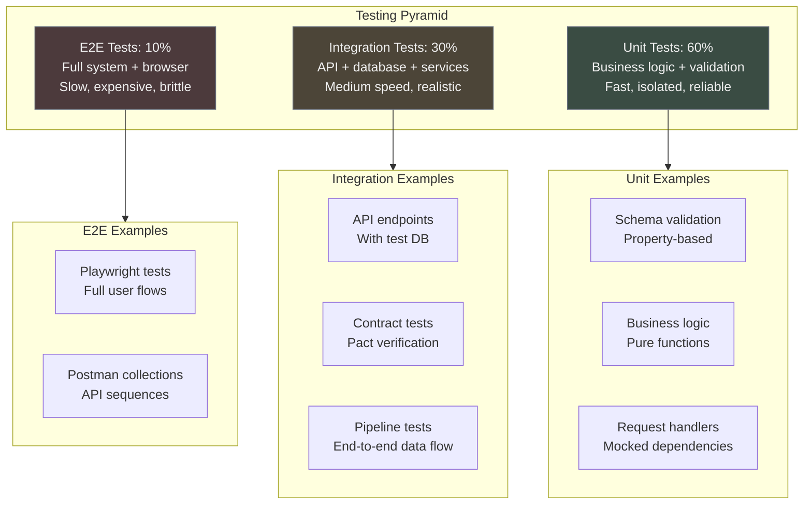
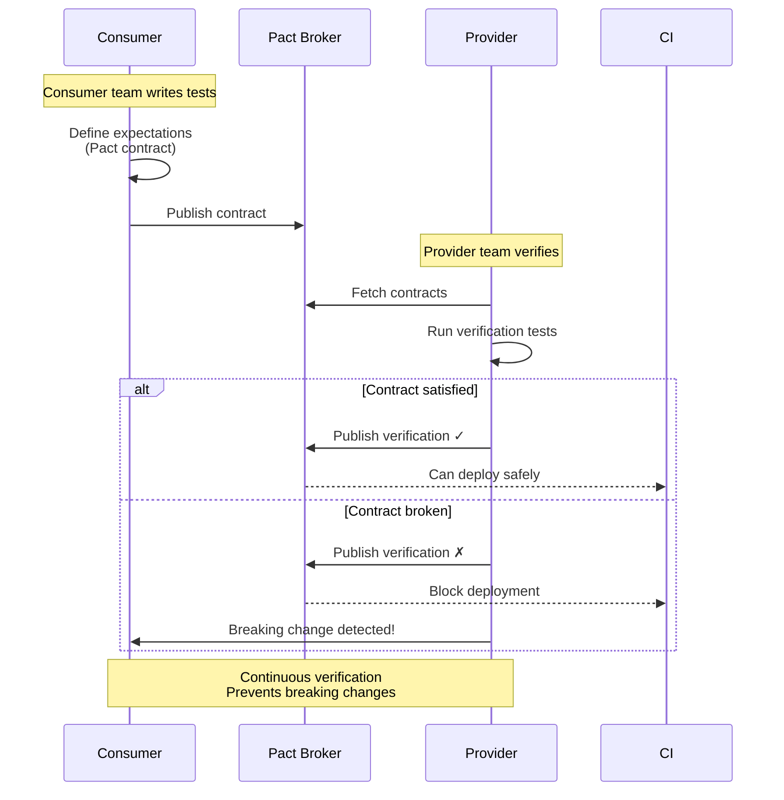
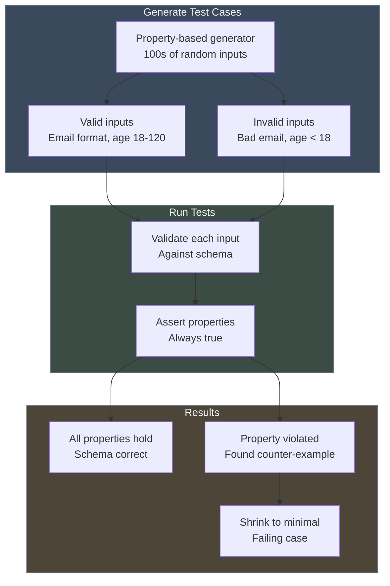
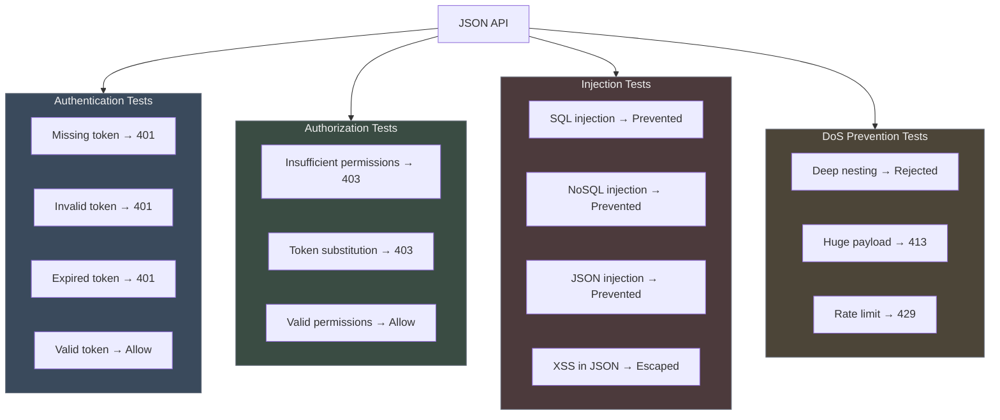
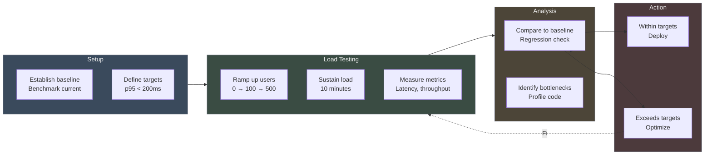
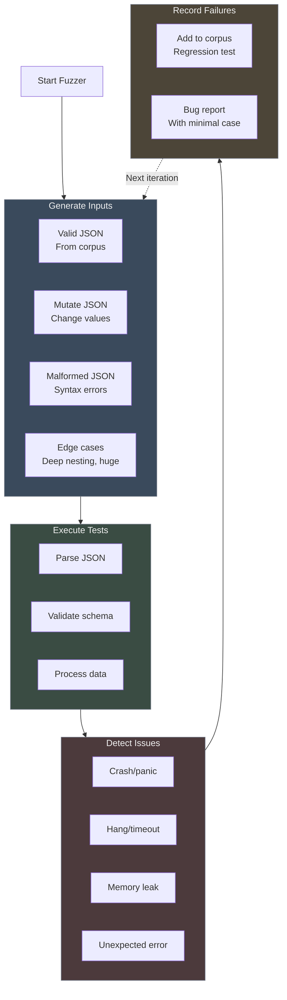

# Chapter 13: Testing JSON Systems - Mermaid Diagrams

**Purpose:** Visual testing strategies and patterns

---

## 1. Test Pyramid for JSON APIs

## 2. Contract Testing Flow

## 3. Property-Based Testing

## 4. API Testing Strategy

```mermaid
flowchart LR
    subgraph unit["Unit Tests"]
        u1[Request validation<br/>JSON Schema]
        u2[Business logic<br/>Pure functions]
        u3[Response formatting<br/>Serialization]
    end
    
    subgraph integration["Integration Tests"]
        i1[Endpoint + DB<br/>Real database]
        i2[Auth flow<br/>JWT verification]
        i3[Error handling<br/>All status codes]
    end
    
    subgraph contract["Contract Tests"]
        c1[Consumer expectations<br/>Pact contracts]
        c2[Provider verification<br/>Contract compliance]
    end
    
    subgraph e2e["E2E Tests"]
        e1[Full user flows<br/>Browser automation]
        e2[API sequences<br/>Multi-step scenarios]
    end
    
    unit --> integration
    integration --> contract
    contract --> e2e
    
    style unit fill:#3A4C43,stroke:#6b7280,color:#f0f0f0
    style integration fill:#3A4A5C,stroke:#6b7280,color:#f0f0f0
    style contract fill:#4C4538,stroke:#6b7280,color:#f0f0f0
    style e2e fill:#4C3A3C,stroke:#6b7280,color:#f0f0f0
```

## 5. Security Testing Flow

## 6. Performance Testing Workflow

## 7. Fuzz Testing Strategy

## 8. CI/CD Testing Pipeline

```mermaid
flowchart LR
    subgraph commit["On Commit"]
        lint[Lint<br/>ESLint, prettier]
        unit[Unit Tests<br/>Fast, isolated]
        format[Format check<br/>JSON formatting]
    end
    
    subgraph pr["On Pull Request"]
        integration[Integration Tests<br/>With test DB]
        contract[Contract Tests<br/>Pact verification]
        security[Security Scan<br/>SAST, dependencies]
    end
    
    subgraph deploy["On Deploy"]
        smoke[Smoke Tests<br/>Basic health checks]
        load[Load Tests<br/>Performance verify]
        monitor[Monitor<br/>Error rates]
    end
    
    commit --> pr
    pr --> deploy
    
    style commit fill:#3A4C43,stroke:#6b7280,color:#f0f0f0
    style pr fill:#3A4A5C,stroke:#6b7280,color:#f0f0f0
    style deploy fill:#4C4538,stroke:#6b7280,color:#f0f0f0
```

