# Chapter 14: Beyond JSON - Future Mermaid Diagrams

**Purpose:** Visual roadmap for data format evolution and decision-making

---

## 1. Format Selection Decision Tree

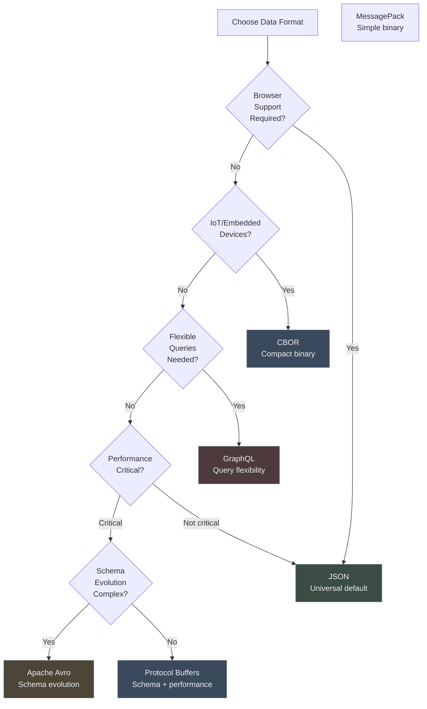

## 2. Format Comparison Matrix

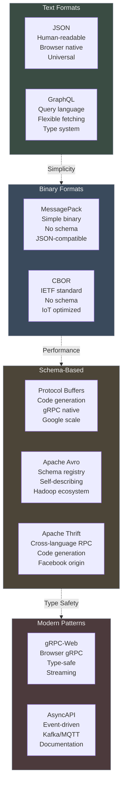

## 3. Migration Path Timeline

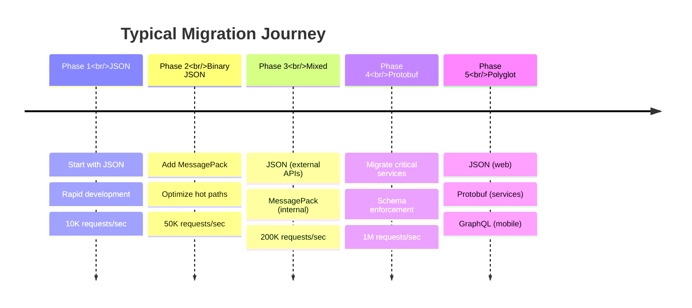

## 4. REST vs GraphQL vs gRPC

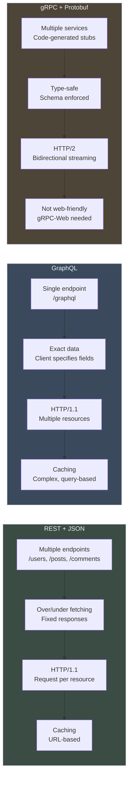

## 5. Schema Evolution Comparison


## 6. JSON in Modern Contexts

```mermaid
flowchart TB
    subgraph edge["Edge Computing"]
        cf[Cloudflare Workers<br/>JSON everywhere]
        fastly[Fastly Compute<br/>JSON processing]
        lambda[Lambda@Edge<br/>JSON transforms]
    end
    
    subgraph wasm["WebAssembly"]
        rust[Rust → WASM<br/>serde_json]
        go[Go → WASM<br/>encoding/json]
        boundary[String marshaling<br/>Performance cost]
    end
    
    subgraph iot["IoT Devices"]
        cbor1[CBOR preferred<br/>Binary efficiency]
        lorawan[LoRaWAN<br/>Payload limits]
        battery[Battery life<br/>Transmission cost]
    end
    
    subgraph blockchain["Blockchain"]
        eth[Ethereum<br/>JSON-RPC standard]
        web3[Web3.js<br/>JSON everywhere]
        universal[Universal format<br/>All chains]
    end
    
    subgraph serverless["Serverless"]
        events[Event payloads<br/>JSON default]
        config[Configuration<br/>JSON files]
        apis[API Gateway<br/>JSON transforms]
    end
    
    edge -.Low latency.-> wasm
    wasm -.Constraints.-> iot
    iot -.Efficiency.-> blockchain
    blockchain -.Compatibility.-> serverless
    
    style edge fill:#3A4A5C,stroke:#6b7280,color:#f0f0f0
    style wasm fill:#3A4C43,stroke:#6b7280,color:#f0f0f0
    style iot fill:#4C4538,stroke:#6b7280,color:#f0f0f0
    style blockchain fill:#4C3A3C,stroke:#6b7280,color:#f0f0f0
    style serverless fill:#3A4A5C,stroke:#6b7280,color:#f0f0f0
```

## 7. Protobuf Schema Example

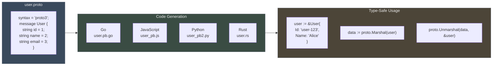

## 8. GraphQL Query Flow

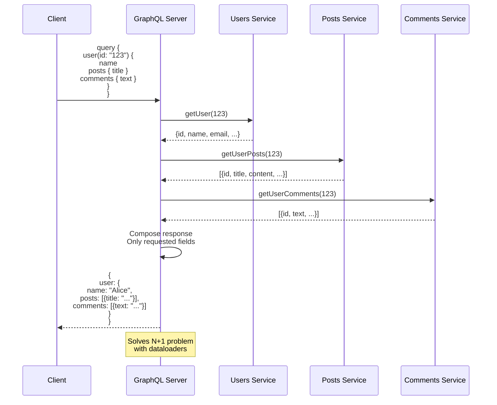

## 9. Size Comparison Visualization

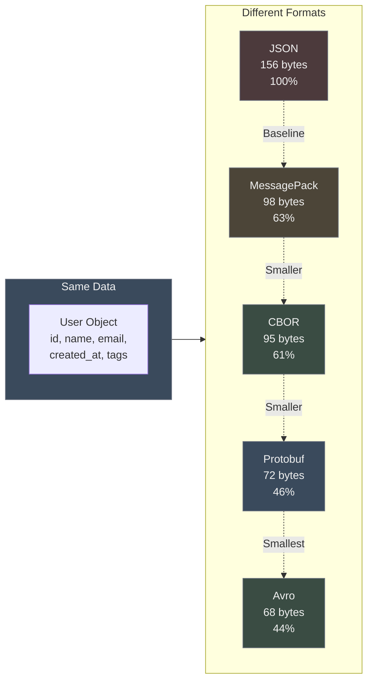

## 10. Architectural Zeitgeist Evolution

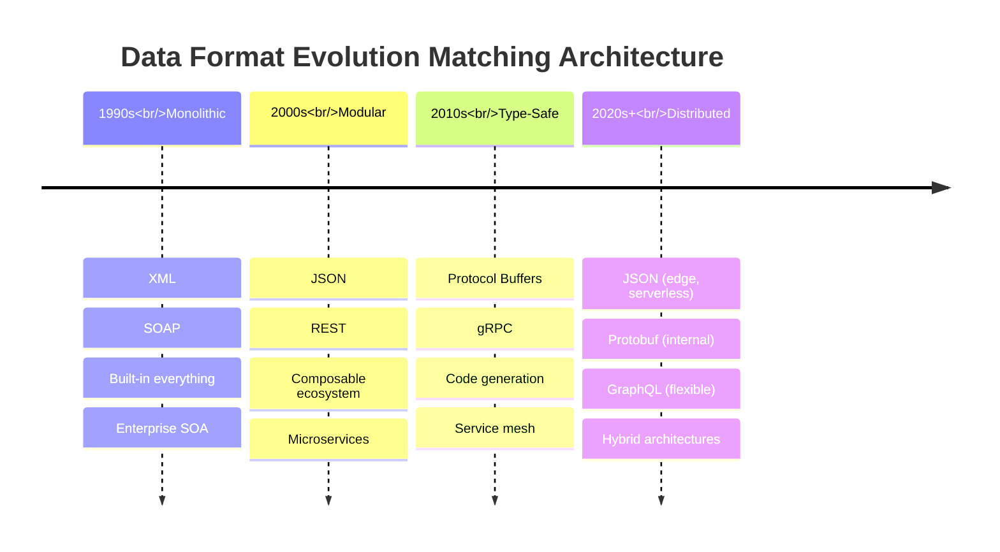

## 11. When to Migrate from JSON

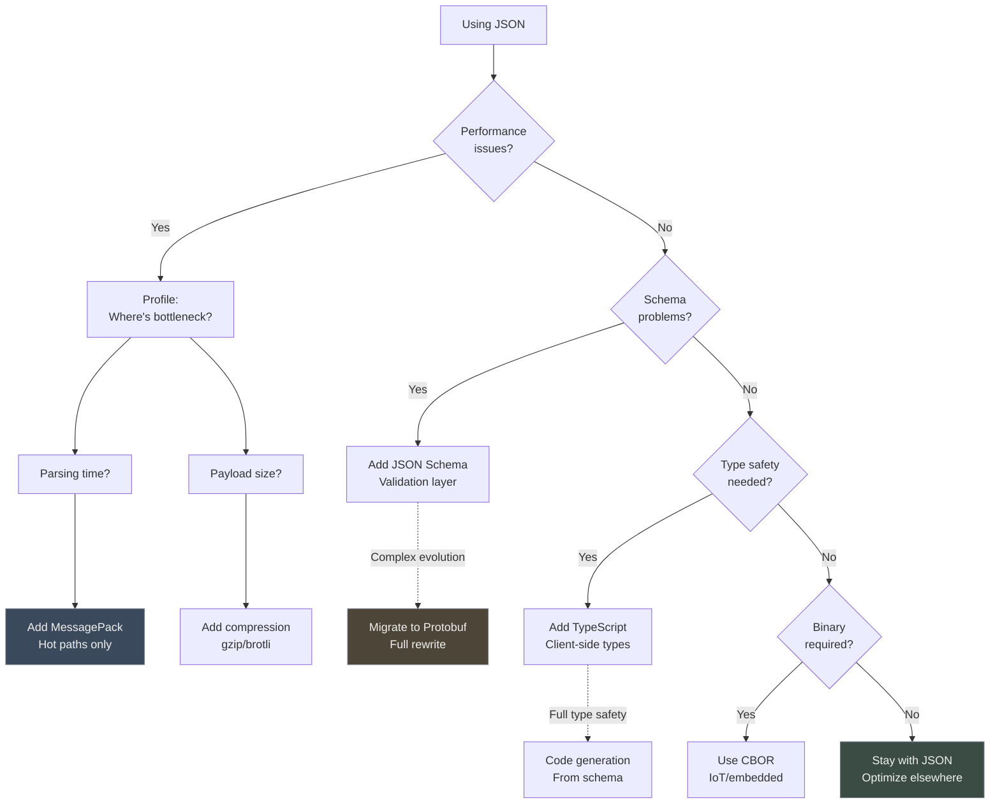

## 12. Future Prediction Model

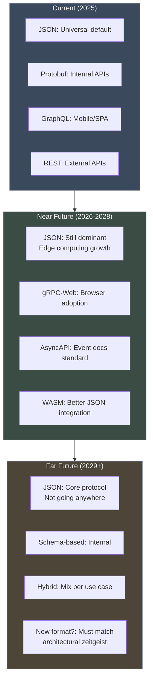

## 13. Lessons Applied to Future Formats

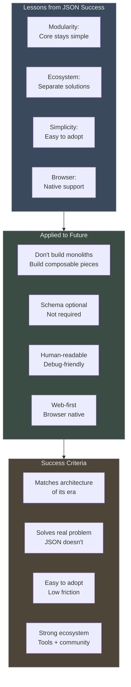
