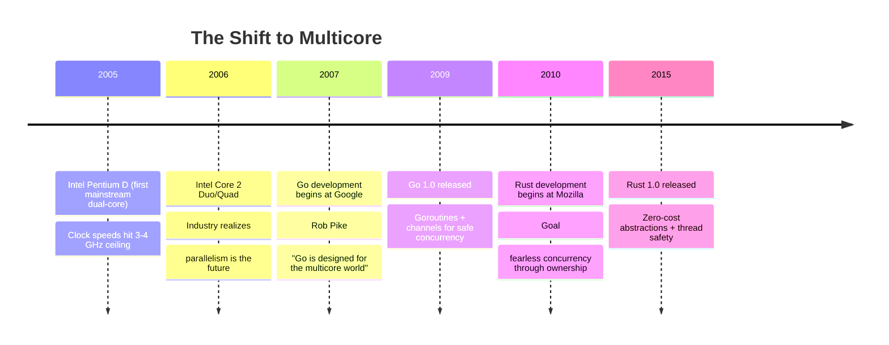

*Originally published on [Blackwell Systems Blog](https://blog.blackwell-systems.com/posts/multicore-killed-oop/)*

---

For 30 years (1980s-2010s), object-oriented programming was the dominant paradigm. Java, Python, Ruby, C++, C# - all centered their design around objects: bundles of data and behavior, allocated on the heap, accessed through references.

Then something changed.

Languages designed after 2007 - Go, Rust, Zig - deliberately rejected classical OOP patterns. No classes. No inheritance. No default reference semantics. Why?

> **The Multicore Revolution**
>
> In 2005, Intel released the Pentium D - the first mainstream dual-core processor. By 2007, quad-core CPUs were common. CPU clock speeds had hit a wall (~3-4 GHz), and the only path to faster programs was parallelism: running code on multiple cores simultaneously.
>
> This hardware shift exposed a fundamental flaw in OOP's design: **shared mutable state through references makes concurrent programming catastrophic**.

This post explores how the need for safe, efficient concurrency drove modern languages to abandon OOP's reference semantics in favor of value semantics.

---

## The OOP Design Choice: References by Default

Object-oriented languages made a deliberate choice: **assignment copies references (pointers), not data**.

### Python: Everything Is a Reference

```python
class Point:
    def __init__(self, x, y):
        self.x, self.y = x, y

p1 = Point(1, 2)
p2 = p1  # Copies reference, not data

p2.x = 10
print(p1.x)  # 10 - p1 affected! Both reference same object
```

**Memory layout:**

```
Stack:                        Heap:
+--------------+            +--------------+
| p1: 0x1000   |----------->| Point object |
+--------------+     +----->| x: 10, y: 2  |
                     |      +--------------+
+--------------+     |
| p2: 0x1000   |-----+
+--------------+

Both variables point to same object (shared state)
```

### Java: Objects Use References

```java
class Point {
    int x, y;
}

Point p1 = new Point();
p1.x = 1;
p1.y = 2;

Point p2 = p1;  // Copies reference

p2.x = 10;
System.out.println(p1.x);  // 10 - p1 affected!
```

Java splits the difference: primitives (`int`, `double`) use value semantics, but objects use reference semantics.

### Why This Design?

Reference semantics enabled:

1. **Efficient passing** - Pass 8-byte pointer instead of copying large objects
2. **Shared state** - Multiple parts of code operate on same data
3. **Polymorphism** - References enable dynamic dispatch through vtables
4. **Object identity** - Objects have identity (`id()` in Python, `==` checks reference in Java)

This worked well in the **single-threaded era** of the 1990s-2000s. The problems were manageable:
- Hidden mutations were confusing but debuggable
- Memory leaks were an issue (pre-GC) but deterministic
- Performance was good enough for most applications

But everything changed when CPUs went multicore.

---

## The Multicore Catalyst (2005-2010)



**The hardware reality:** CPU speeds stopped increasing. Single-threaded performance plateaued. The only way to make programs faster was to use multiple cores - which meant writing concurrent code.

**The software problem:** OOP's reference semantics, which were merely "confusing" in single-threaded code, became **catastrophic** in concurrent code.

---

## Threads Existed Before Multicore

A common misconception: threads were invented for multicore CPUs. Actually, threads predate multicore by **decades**.

**Timeline:**
- **1960s-1970s:** Threads invented for single-core mainframes
- **1995:** Java ships with threading API (Pentium era - single core)
- **2005:** Intel Pentium D - first mainstream multicore
- **Gap:** 30+ years of threads on single-core systems

**Why threads on single core?**

Threads solved **concurrency** (I/O multiplexing), not parallelism:

```python
# Web server on single Pentium (1995)
def handle_client(client):
    request = client.recv()         # I/O wait (10ms)
    data = database.query(request)  # I/O wait (50ms)
    client.send(data)               # I/O wait (10ms)

# While Thread 1 waits for I/O, Thread 2 runs
# CPU never idle despite I/O delays
# 100 threads serve 100 clients on 1 core
```

**Time-slicing visualization:**

```
Single Core (1995):
Time:  0ms   10ms  20ms  30ms  40ms
CPU:   [T1]  [T2]  [T3]  [T1]  [T2]
       ^ Rapid switching (only one executes at a time)

All threads make progress, but not simultaneously
```

**This worked fine with reference semantics** because:
- Only one thread executing at any moment (time-slicing)
- Context switches at predictable points
- Race conditions possible but rare
- Locks needed, but contention low

**Multicore changed everything:**

```
Dual Core (2005):
Time:  0ms----------------------40ms
Core 1: [Thread 1 continuously]
Core 2: [Thread 2 continuously]
        ^ True simultaneous execution

NOW threads run truly parallel
```

**The paradigm shift:**

| Era | Hardware | Threads For | Locks |
|-----|----------|-------------|-------|
| Pre-2005 | Single core | I/O concurrency | Nice to have |
| Post-2005 | Multicore | CPU parallelism | **Mandatory** |

> **Threads Weren't the Problem**
>
> Threads worked fine for 30+ years on single-core systems. The crisis emerged when:
>
> **Threads + Multicore + Reference Semantics** = Data races everywhere
>
> OOP languages designed in the single-core era (1980s-1990s) assumed sequential execution with occasional context switches. Multicore exposed hidden shared state that had always existed but was protected by time-slicing serialization.

---

## Why Reference Semantics Broke with Concurrency

### Single-Threaded: Annoying but Manageable

```python
# Python: Shared mutable state (single-threaded)
users = []

def add_user(user):
    users.append(user)  # Modifies shared list

def process_users():
    for user in users:
        user['active'] = False  # Modifies shared objects

# Problems:
# - Hidden mutation (users modified without explicit indication)
# - Hard to track where changes happen
# - Confusing for debugging
# 
# But: Deterministic, debuggable, doesn't crash
```

### Multi-Threaded: Race Conditions Everywhere

```python
# Same code, now with threads
import threading

users = []
lock = threading.Lock()  # Must add locks everywhere!

def add_user(user):
    with lock:  # Lock required
        users.append(user)

def process_users():
    with lock:  # Lock required
        for user in users:
            user['active'] = False

# Thread 1: add_user()
# Thread 2: process_users()
# 
# Without locks: DATA RACE
# - Both threads modify users simultaneously
# - List corruption, crashes, lost data
# 
# With locks: SERIALIZED
# - Threads wait for each other
# - No parallelism achieved
# - Defeats the purpose of multiple cores!
```

**The fundamental problem:** Reference semantics mean **all state is shared by default**. In concurrent code, shared mutable state requires synchronization (locks), which:

1. **Serializes execution** - Only one thread can access locked section (**defeats parallelism**)
2. **Adds complexity** - Every shared access needs lock/unlock logic
3. **Enables deadlocks** - Multiple locks can deadlock if acquired in wrong order
4. **Hides race conditions** - Forget one lock, and you have data corruption

> **Mutexes: The Band-Aid That Kills Performance**
>
> Mutexes don't solve OOP's concurrency problems - they're a band-aid that sacrifices the very parallelism you're trying to achieve. Locked critical sections serialize execution, turning parallel code into sequential code.

---

## The Post-OOP Response: Value Semantics for Safe Concurrency

### Go's Solution (2007-2009): Values + Goroutines + Channels

Go's designers (Ken Thompson, Rob Pike, Robert Griesemer) came from systems programming backgrounds and saw the concurrency crisis firsthand at Google. Their solution: **value semantics by default, with explicit sharing**.

```go
// Go: Values are copied by default
type Point struct {
    X, Y int
}

p1 := Point{1, 2}
p2 := p1  // Copies the entire struct (independent copy)

p2.X = 10
fmt.Println(p1.X)  // 1 - p1 unchanged!
```

**Memory layout:**

```
Stack:
+--------------+    +--------------+
| p1           |    | p2           |
| X: 1, Y: 2   |    | X: 10, Y: 2  |
+--------------+    +--------------+

Two independent copies (no shared state)
```

**Concurrent code is safe by default:**

```go
// Each goroutine gets independent copy
func worker(id int, data []int) {
    // Make local copy
    localData := make([]int, len(data))
    copy(localData, data)
    
    // Process independently - NO LOCKS NEEDED
    for i := range localData {
        localData[i] *= 2
    }
}

// Spawn 1000 workers (cheap, safe, parallel)
data := []int{1, 2, 3, 4, 5}
for i := 0; i < 1000; i++ {
    go worker(i, data)  // Each gets independent copy
}
```

Each goroutine operates on independent data. No shared state = no locks = true parallelism.

> **Go's Concurrency Mantra**
>
> "Don't communicate by sharing memory; share memory by communicating."
>
> Value semantics + channels = safe parallelism without locks.

### Rust's Solution (2010-2015): Ownership + Borrow Checker

Rust took a different approach: enforce thread safety at **compile time** through ownership rules.

```rust
// Rust: Ownership prevents data races
let data = vec![1, 2, 3];

// ERROR: Can't share mutable reference
thread::spawn(move || {
    data.push(4);  // Would move ownership
});
// data no longer accessible here - COMPILE ERROR
```

**Ownership rules:**

1. Each value has exactly one owner
2. When owner goes out of scope, value is dropped
3. References are borrowed, not owned
4. Can't have mutable reference while immutable references exist

**Result:** The compiler prevents data races. No runtime locks, no race conditions, no undefined behavior.

> **Rust's Concurrency Guarantee**
>
> "Fearless concurrency: If it compiles, it's thread-safe."
>
> The borrow checker enforces memory safety and prevents data races at compile time.

---

## The Performance Bonus: Cache Locality

Concurrency was the primary driver for value semantics, but there was a significant **performance bonus**: cache locality.

### The Problem with References: Pointer Chasing

Modern CPUs read memory in **cache lines** (typically 64 bytes). When you access address X, the CPU fetches X plus the next 63 bytes into cache.

**Reference semantics destroy cache locality:**

```python
# Python: Array of Point objects (references)
points = [Point(i, i) for i in range(1000)]

# Memory layout (scattered on heap):
# points[0] -> 0x1000 (heap)
# points[1] -> 0x5000 (heap, different location)
# points[2] -> 0x9000 (heap, different location)
# ...

# Iteration requires pointer chasing (cache misses)
sum = 0
for p in points:
    sum += p.x + p.y  # Each access: follow pointer -> cache miss
```

**Value semantics enable cache-friendly layout:**

```go
// Go: Array of Point values (contiguous)
type Point struct { X, Y int }
points := make([]Point, 1000)

// Memory layout (contiguous):
// [Point{0,0}, Point{1,1}, Point{2,2}, ...]
// All data in sequential memory

// Iteration is cache-friendly (prefetching works)
sum := 0
for i := range points {
    sum += points[i].X + points[i].Y  // Sequential access, cache hits
}
```

**Performance impact:**

```
Benchmark: Sum 1 million Point coordinates

Python (references):  ~50-100 milliseconds
                      - Pointer chasing
                      - Cache misses every access

Go (values):          ~10-20 milliseconds  
                      - Sequential memory access
                      - CPU prefetches cache lines

Speedup: 3-5 faster
```

> **Why This Matters**
>
> Cache locality wasn't the driver for value semantics - concurrency was. But it turned out that the same design choice that makes concurrent code safe (independent copies) also makes sequential code faster (contiguous memory).
>
> Value semantics deliver both safety and performance.

---

## The Lock Bottleneck: How Mutexes Kill Parallelism

Let's look concretely at why locks defeat the purpose of multicore CPUs.

### The Setup: Parallel Processing

```go
// Goal: Process 1000 items in parallel
type Item struct { ID int, Value string }
type Result struct { ID int, Processed string }

func processItem(item Item) Result {
    // Expensive computation (takes 1ms)
    time.Sleep(1 * time.Millisecond)
    return Result{item.ID, strings.ToUpper(item.Value)}
}
```

### Approach 1: Shared Slice with Mutex (BAD)

```go
func processWithMutex(items []Item) []Result {
    var results []Result
    var mu sync.Mutex  // Protects shared slice
    
    var wg sync.WaitGroup
    for _, item := range items {
        wg.Add(1)
        go func(it Item) {
            defer wg.Done()
            
            result := processItem(it)  // Parallel (1ms per item)
            
            mu.Lock()
            results = append(results, result)  // SERIALIZED!
            mu.Unlock()
            // Only one goroutine can append at a time
        }(item)
    }
    wg.Wait()
    return results
}
```

**Performance:**

```
Best case (sequential):   1000 items  1ms = 1000ms
With mutex (1000 cores):  1000ms compute + serialized append
                         Still slow due to lock contention
```

### Approach 2: Value Copies with Local Aggregation (GOOD)

```go
func processWithValues(items []Item) []Result {
    numWorkers := runtime.NumCPU()  // e.g., 8 cores
    chunkSize := len(items) / numWorkers
    
    type workResult struct {
        results []Result
    }
    resultsChan := make(chan workResult, numWorkers)
    
    // Spawn workers
    for i := 0; i < numWorkers; i++ {
        start := i * chunkSize
        end := start + chunkSize
        if i == numWorkers-1 {
            end = len(items)
        }
        
        go func(chunk []Item) {
            // Each worker has independent slice (NO LOCK!)
            localResults := make([]Result, 0, len(chunk))
            
            for _, item := range chunk {
                result := processItem(item)
                localResults = append(localResults, result)  // Local only
            }
            
            resultsChan <- workResult{localResults}
        }(items[start:end])
    }
    
    // Combine results (single goroutine, no contention)
    var results []Result
    for i := 0; i < numWorkers; i++ {
        wr := <-resultsChan
        results = append(results, wr.results...)
    }
    return results
}
```

**Performance:**

```
Sequential:        1000 items  1ms = 1000ms
With mutex:        ~800-900ms (lock contention)
With value copies: 1000 items  8 cores  1ms = 125ms

Speedup: 8 faster (full parallelism, no serialization)
```

> **The Value Semantics Win**
>
> Each worker operates on independent data (value copies). No locks needed, no serialization, no contention. Result: true parallelism and 8 speedup on 8 cores.
>
> This is impossible with OOP's shared mutable state through references.

---

## When OOP Still Makes Sense

Value semantics aren't a silver bullet. Some domains naturally fit OOP's reference semantics:

### 1. UI Frameworks

Widgets form natural hierarchies. References make sense here.

**But:** Even UI frameworks are moving away from OOP:
- React: Functional components, immutable state
- SwiftUI: Value types, declarative syntax
- Jetpack Compose: Composable functions, not classes

### 2. Game Engines (Entity-Component Systems)

Modern game engines use **ECS (Entity-Component System)**, which is fundamentally anti-OOP.

### 3. Legacy Codebases

Millions of lines of Java/C++/Python exist. Rewriting is expensive.

**Pragmatic approach:** Use value semantics for new code, maintain OOP for legacy.

---

## Conclusion

Object-oriented programming wasn't killed by bad design or theoretical flaws. It was killed by hardware evolution.

When CPUs went multicore in 2005, OOP's fundamental design choice - **shared mutable state through references** - went from "convenient but confusing" to "catastrophic for concurrency."

Modern languages (Go, Rust) chose value semantics specifically to make concurrent programming safe by default:

- Values are independent copies (no shared state)
- No shared state = no locks needed
- No locks = true parallelism (full CPU utilization)

The performance benefits (cache locality, stack allocation) were a bonus. The driver was concurrency.

After 30 years of OOP dominance, the pendulum has swung. Value semantics are the new default. References still exist, but they're explicit - you opt into sharing rather than opting out.

**The lesson:** Language design is shaped by hardware constraints. As hardware evolves (multicore, SIMD, GPUs), language design evolves to match.

OOP served us well for three decades. But the multicore era demands a different approach. Value semantics aren't perfect, but they're better suited to the hardware reality of 2020s and beyond.

---

## Further Reading

**Related articles:**
- [Go's Value Philosophy: Part 1](https://blog.blackwell-systems.com/posts/go-values-not-objects/) - Deep dive into Go's value semantics
- [Go's Value Philosophy: Part 2](https://blog.blackwell-systems.com/posts/go-values-escape-analysis/) - How Go optimizes value allocation
- [Python Object Overhead](https://blog.blackwell-systems.com/posts/python-object-overhead/) - The cost of Python's everything-is-an-object model

**External resources:**
- [Go Blog - Share Memory By Communicating](https://go.dev/blog/codelab-share)
- [The Rust Book - Ownership](https://doc.rust-lang.org/book/ch04-00-understanding-ownership.html)
- [Mike Acton - Data-Oriented Design](https://www.youtube.com/watch?v=rX0ItVEVjHc)
